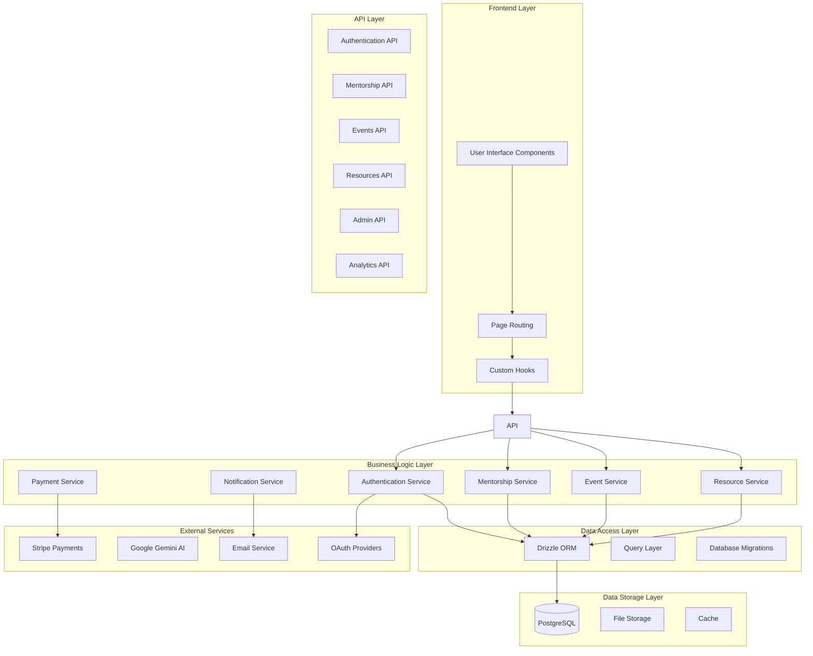
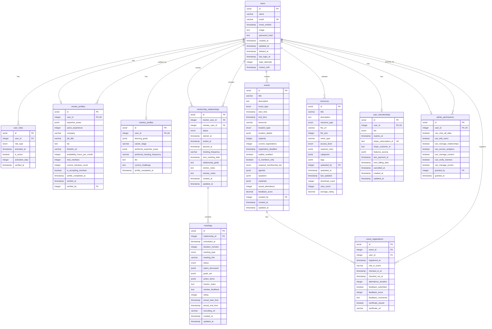
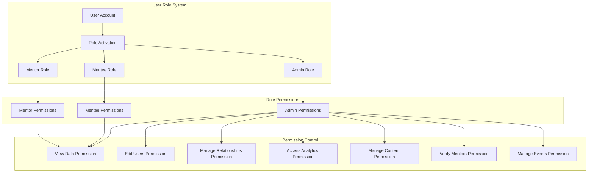
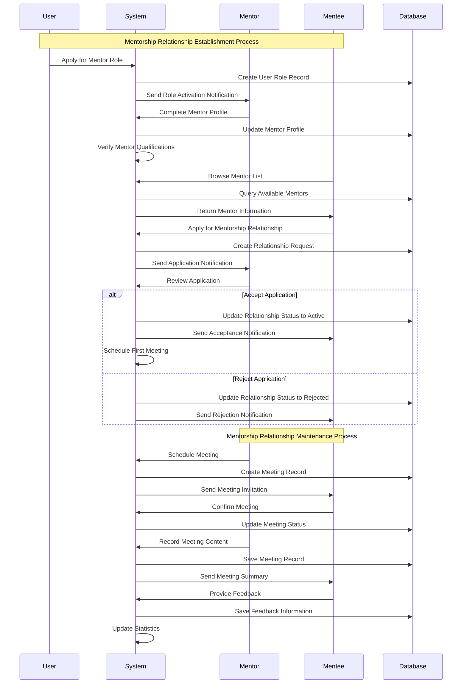
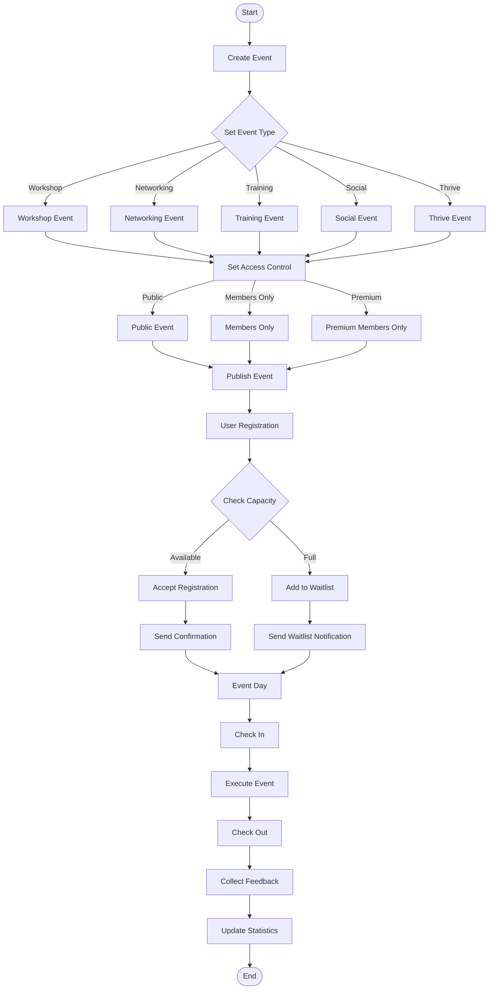
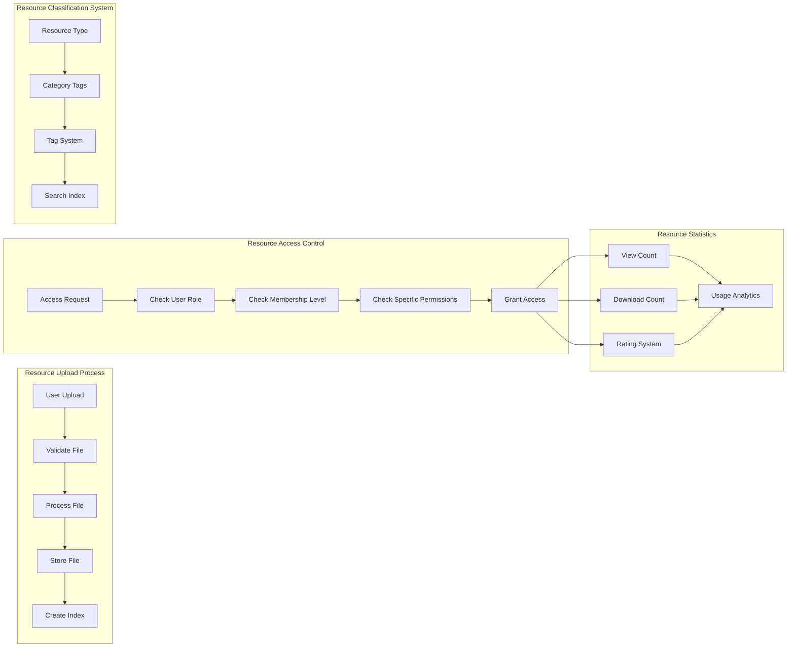
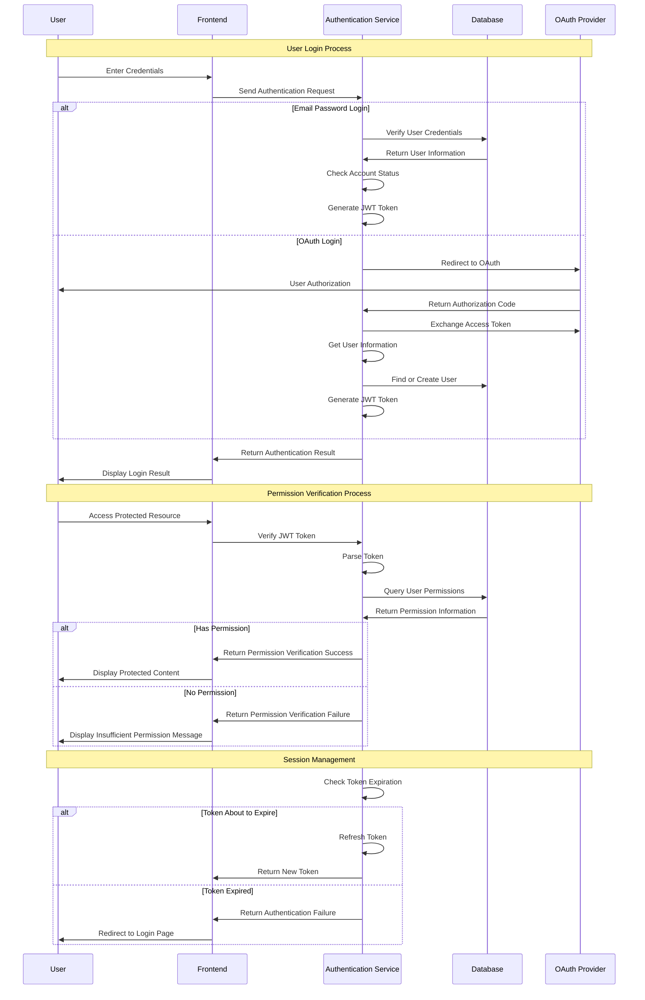
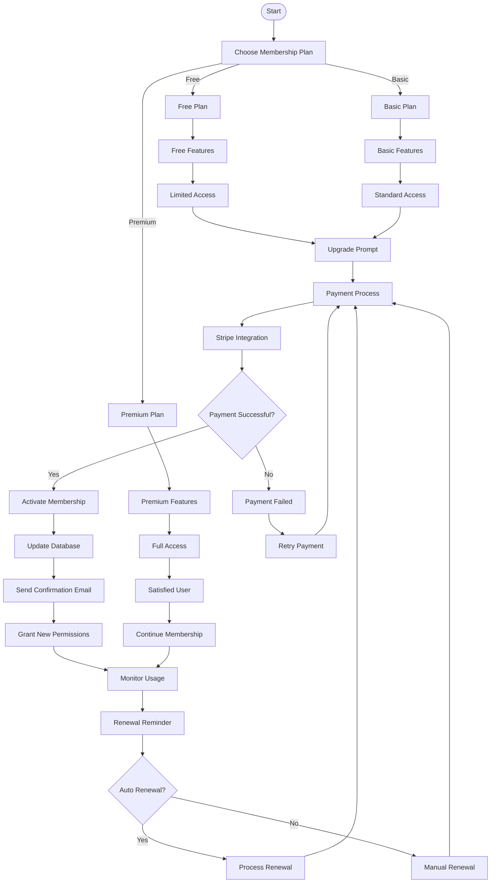

# She Sharp Project Architecture Diagrams

This document contains mermaid diagrams showcasing the system architecture, database structure, and business logic of the She Sharp project.

## Table of Contents

1. [System Architecture Overview](#system-architecture-overview)
2. [Database Entity Relationship Diagram](#database-entity-relationship-diagram)
3. [User Roles and Permissions Architecture](#user-roles-and-permissions-architecture)
4. [Mentorship Relationship Business Process](#mentorship-relationship-business-process)
5. [Event Management System Flow](#event-management-system-flow)
6. [Resource Management System](#resource-management-system)
7. [Authentication and Authorization Flow](#authentication-and-authorization-flow)
8. [Membership Subscription System](#membership-subscription-system)

---

## System Architecture Overview

---

## Database Entity Relationship Diagram

---

## User Roles and Permissions Architecture

---

## Mentorship Relationship Business Process

---

## Event Management System Flow

---

## Resource Management System

---

## Authentication and Authorization Flow

---

## Membership Subscription System

---

## Summary

These diagrams showcase the complete architecture of the She Sharp project:

1. **System Architecture Overview**: Displays the complete technology stack from frontend to database
2. **Database Entity Relationship Diagram**: Detailed view of all data table relationships
3. **User Roles and Permissions Architecture**: Illustrates the multi-role system permission control
4. **Mentorship Relationship Business Process**: Shows the complete lifecycle of mentorship relationships
5. **Event Management System Flow**: Explains the complete process from event creation to execution
6. **Resource Management System**: Demonstrates resource upload, access control, and statistics
7. **Authentication and Authorization Flow**: Detailed explanation of user authentication and permission verification
8. **Membership Subscription System**: Shows the complete flow of membership levels and payment system

These diagrams help development teams:
- Better understand the system architecture
- Provide guidance for new feature development
- Offer reference for system maintenance and optimization
- Provide quick onboarding materials for new team members
