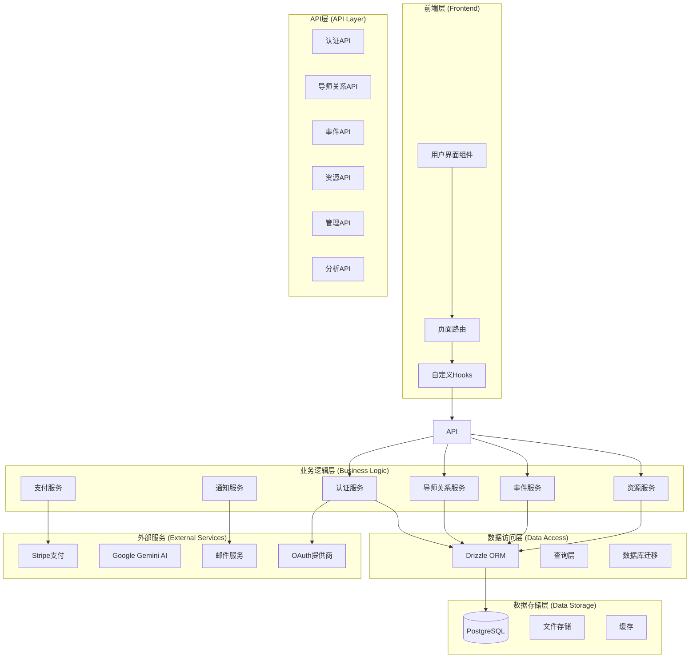
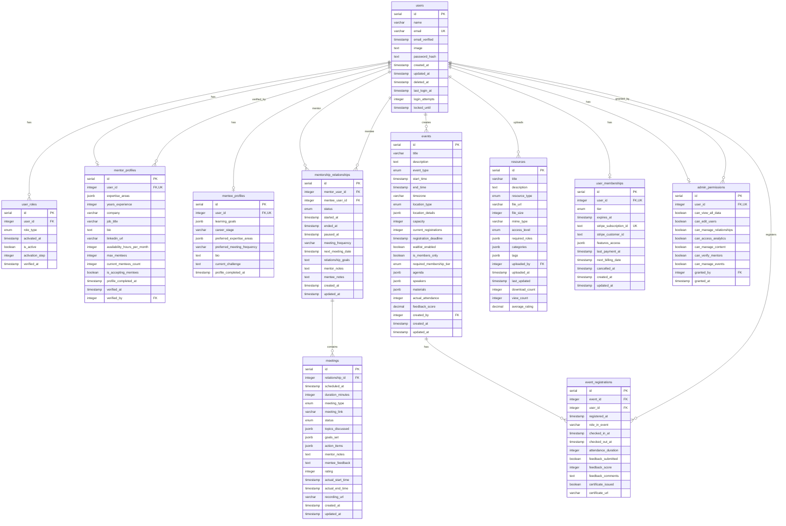
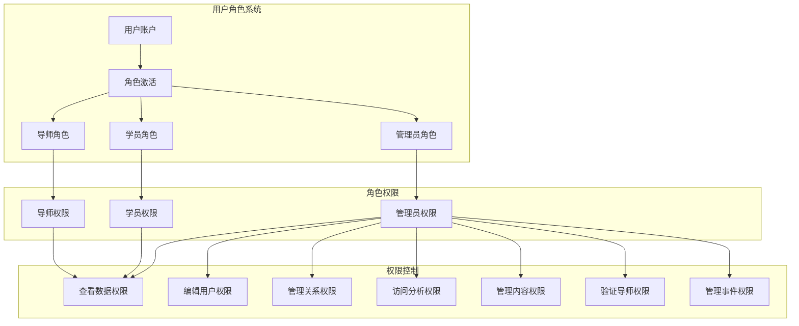
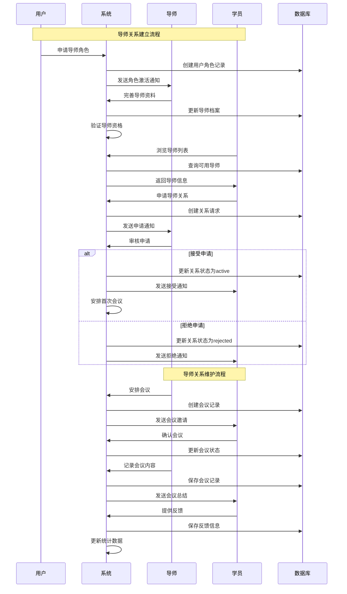
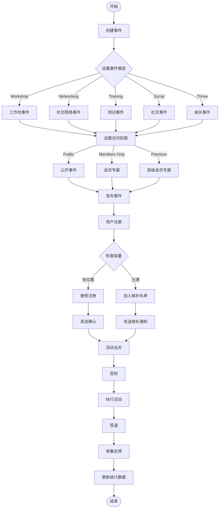
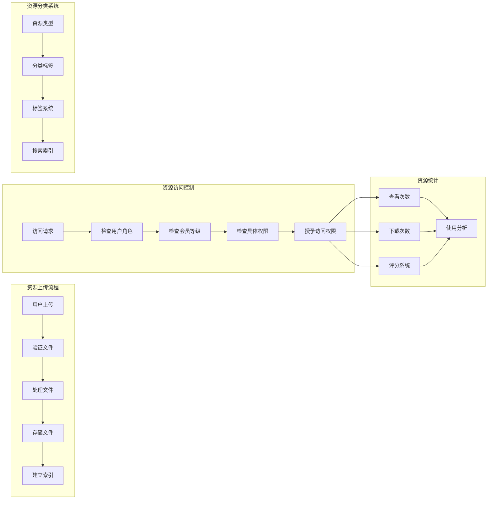
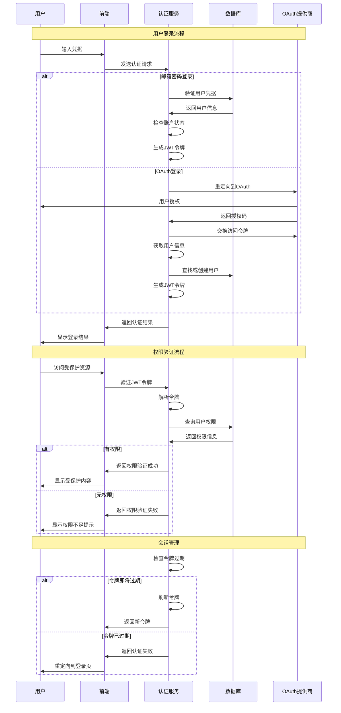
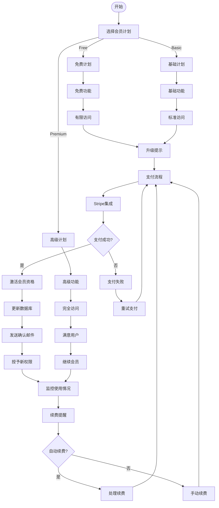

# She Sharp 项目架构图表

本文档包含了 She Sharp 项目的系统架构、数据库结构和业务逻辑的 mermaid 图表。

## 目录

1. [系统架构概览](#系统架构概览)
2. [数据库实体关系图](#数据库实体关系图)
3. [用户角色和权限架构](#用户角色和权限架构)
4. [导师关系业务流程](#导师关系业务流程)
5. [事件管理系统流程](#事件管理系统流程)
6. [资源管理系统](#资源管理系统)
7. [认证和授权流程](#认证和授权流程)
8. [会员订阅系统](#会员订阅系统)

---

## 系统架构概览

---

## 数据库实体关系图

---

## 用户角色和权限架构

---

## 导师关系业务流程

---

## 事件管理系统流程

---

## 资源管理系统

---

## 认证和授权流程

---

## 会员订阅系统

---

## 总结

这些图表展示了 She Sharp 项目的完整架构：

1. **系统架构概览**: 展示了从前端到数据库的完整技术栈
2. **数据库实体关系图**: 详细展示了所有数据表之间的关系
3. **用户角色和权限架构**: 说明了多角色系统的权限控制
4. **导师关系业务流程**: 展示了导师关系的完整生命周期
5. **事件管理系统流程**: 说明了事件从创建到执行的完整流程
6. **资源管理系统**: 展示了资源的上传、访问控制和统计
7. **认证和授权流程**: 详细说明了用户认证和权限验证的流程
8. **会员订阅系统**: 展示了会员等级和支付系统的完整流程

这些图表可以帮助开发团队更好地理解系统架构，为新功能的开发提供指导，也为系统维护和优化提供参考。
