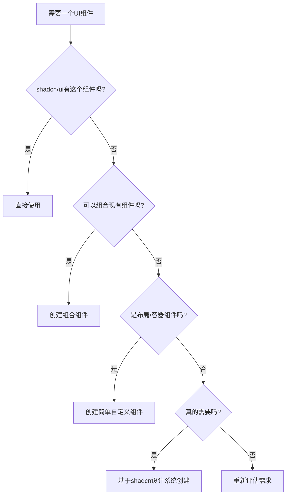

# She Sharp 优化的 shadcn/ui 组件策略

基于完整的 shadcn/ui 组件清单分析，以下是优化后的组件使用策略。

## 🎯 核心发现

1. **shadcn/ui 提供了 60+ 个组件**，几乎覆盖所有常见 UI 需求
2. 项目已正确配置 `components.json`，使用 `new-york` 风格
3. 支持 React Server Components (RSC)
4. 使用 CSS 变量系统，完美兼容我们的颜色方案

## 📦 She Sharp 网站组件映射（更新版）

### 1. 全局布局组件
| 需求 | shadcn/ui 组件 | 状态 | 安装命令 |
|------|---------------|------|----------|
| 主导航 | Navigation Menu | ⚡ | `npx shadcn@latest add navigation-menu` |
| 移动菜单 | Sheet | ⚡ | `npx shadcn@latest add sheet` |
| 侧边栏（可选） | Sidebar | ⚡ | `npx shadcn@latest add sidebar` |
| 面包屑导航 | Breadcrumb | ⚡ | `npx shadcn@latest add breadcrumb` |

### 2. 首页组件
| 需求 | shadcn/ui 组件 | 状态 | 备注 |
|------|---------------|------|------|
| Hero 按钮 | Button | ✅ | 已安装 |
| 统计卡片 | Card | ✅ | 已安装 |
| 承诺标签页 | Tabs | ⚡ | 连接/启发/赋能切换 |
| 赞助商轮播 | Carousel | ⚡ | Logo 展示 |
| 视频播放控制 | Toggle | ⚡ | 播放/暂停按钮 |
| 加载状态 | Skeleton | ⚡ | 图片/视频加载 |

### 3. 关于我们页面
| 需求 | shadcn/ui 组件 | 状态 | 备注 |
|------|---------------|------|------|
| 团队成员卡片 | Card + Avatar | ✅ | 已安装 |
| 角色标签 | Badge | ⚡ | 显示职位 |
| 成员详情 | Dialog | ⚡ | 点击查看更多 |
| 内容折叠 | Collapsible | ⚡ | 长内容展开 |
| 悬停卡片 | Hover Card | ⚡ | 快速预览 |

### 4. 活动页面
| 需求 | shadcn/ui 组件 | 状态 | 备注 |
|------|---------------|------|------|
| 活动卡片 | Card | ✅ | 已安装 |
| 日期选择 | Calendar + Date Picker | ⚡ | 筛选活动 |
| 类别筛选 | Select | ⚡ | 下拉选择 |
| 搜索功能 | Command | ⚡ | 高级搜索 |
| 分页 | Pagination | ⚡ | 活动列表 |
| 活动状态 | Badge | ⚡ | 即将开始/进行中/已结束 |

### 5. 导师计划
| 需求 | shadcn/ui 组件 | 状态 | 备注 |
|------|---------------|------|------|
| 导师卡片 | Card + Avatar | ✅ | 已安装 |
| 专业领域 | Badge | ⚡ | 技能标签 |
| 申请表单 | Form + 各种输入组件 | ⚡ | 完整表单 |
| 进度展示 | Progress | ⚡ | 申请流程 |
| 手风琴 | Accordion | ⚡ | FAQ部分 |

### 6. 媒体中心
| 需求 | shadcn/ui 组件 | 状态 | 备注 |
|------|---------------|------|------|
| 图片画廊 | Aspect Ratio + Dialog | ⚡ | 图片展示和放大 |
| 视频列表 | Card + Skeleton | ⚡ | 媒体卡片 |
| 播客播放器 | Card + Progress | ⚡ | 音频控制 |
| 内容表格 | Table + Data Table | ⚡ | 新闻列表 |
| 滚动区域 | Scroll Area | ⚡ | 长列表滚动 |

### 7. 联系页面
| 需求 | shadcn/ui 组件 | 状态 | 备注 |
|------|---------------|------|------|
| 联系表单 | Form | ⚡ | React Hook Form 集成 |
| 输入框 | Input | ✅ | 已安装 |
| 文本域 | Textarea | ⚡ | 留言输入 |
| 下拉选择 | Select | ⚡ | 主题选择 |
| 复选框 | Checkbox | ⚡ | 同意条款 |
| 提交反馈 | Toast/Sonner | ⚡ | 成功/错误提示 |

### 8. 其他通用组件
| 需求 | shadcn/ui 组件 | 状态 | 备注 |
|------|---------------|------|------|
| 提示信息 | Alert | ⚡ | 通知/警告 |
| 确认对话框 | Alert Dialog | ⚡ | 删除确认等 |
| 工具提示 | Tooltip | ⚡ | 帮助信息 |
| 分隔线 | Separator | ⚡ | 内容分隔 |
| 切换开关 | Switch | ⚡ | 设置选项 |
| 右键菜单 | Context Menu | ⚡ | 高级交互 |

## 🚀 分阶段安装计划

### 第一批：核心导航和布局（立即安装）
```bash
npx shadcn@latest add navigation-menu sheet breadcrumb separator
```

### 第二批：内容展示组件（首页开发时）
```bash
npx shadcn@latest add tabs badge carousel skeleton toggle alert
```

### 第三批：表单和交互（联系页面时）
```bash
npx shadcn@latest add form textarea select checkbox toast sonner
```

### 第四批：高级展示（活动/媒体页面时）
```bash
npx shadcn@latest add calendar dialog accordion hover-card aspect-ratio scroll-area
```

### 第五批：数据和列表（后期需要时）
```bash
npx shadcn@latest add table data-table pagination command progress
```

## 🎨 组件定制建议

### 1. 利用 CSS 变量系统
```tsx
// 组件会自动使用我们定义的颜色变量
<Badge> // 自动使用 --primary 颜色
<Button variant="secondary"> // 使用 --secondary 颜色
```

### 2. 创建组合组件
```tsx
// 不需要从零开始，组合现有组件
export function EventCard({ event }) {
  return (
    <Card>
      <AspectRatio ratio={16/9}>
        
      </AspectRatio>
      <CardHeader>
        <div className="flex justify-between">
          <CardTitle>{event.title}</CardTitle>
          <Badge>{event.category}</Badge>
        </div>
      </CardHeader>
      <CardFooter>
        <Button className="w-full">报名参加</Button>
      </CardFooter>
    </Card>
  )
}
```

### 3. 扩展变体
```tsx
// 使用 cn() 工具函数添加自定义样式
<Button 
  className={cn(
    "bg-purple-dark hover:bg-purple-mid",
    "text-white font-semibold"
  )}
>
  自定义按钮
</Button>
```

## 📋 组件选择决策树（优化版）



## 🔧 开发工作流

1. **需求分析** → 明确页面需要什么功能
2. **组件映射** → 查找对应的 shadcn/ui 组件
3. **批量安装** → 一次安装相关组件组
4. **组合使用** → 创建页面特定的组合组件
5. **样式定制** → 使用我们的颜色系统

## 💡 特别推荐

### 被忽视但很有用的组件：
- **Command** - 可以创建强大的搜索功能
- **Combobox** - 搜索+选择的组合
- **Data Table** - 完整的表格解决方案
- **Sonner** - 比 Toast 更优雅的通知
- **Typography** - 统一的文字样式

### 新发现的组件：
- **Sidebar** - 完整的侧边栏解决方案
- **Input OTP** - 验证码输入（未来会员功能）
- **Resizable** - 可调整大小的面板

## ✅ 行动项

1. 先安装第一批核心组件
2. 创建基础布局结构
3. 基于 shadcn/ui 组件构建页面
4. 只在绝对必要时创建自定义组件

这样我们可以：
- 减少 90% 的自定义组件开发
- 保持一致的设计系统
- 加快开发速度
- 确保可访问性和响应式设计