# Event lifecycle — the standard procedure

> How one regular She Sharp event travels from a first conversation with a
> partner, through a Slack channel, a poster, a ticket page, a projector and an
> inbox, to an archive and a newsletter. Written 2026-08-21, rewritten
> 2026-08-23 for the whole team rather than only for the developer, and against
> what actually happens rather than against an intended design.

She Sharp runs a regular evening event roughly monthly — a panel, a talk, a
workshop — plus the occasional flagship. Every regular event needs the same work
in roughly the same order, some of it by hand, some of it by a skill you can
run, and some of it by itself.

**This page is for everybody.** If you organise events, do marketing, talk to
partners, or write the newsletter, the diagrams are the point, and you can stop
reading wherever the detail stops being useful to you. Part C at the end is for
the developer, and you are not missing anything by skipping it.

Two shortcuts worth knowing before anything else:

- `/run-event-playbook` is this document as a skill. It works out where your
  event has got to and tells you what comes next, so nobody has to hold the
  order in their head.
- `npx tsx scripts/events/event-status.ts --slug <event-slug>` answers "where has
  this event got to?" in one screen. It is read-only and cannot break anything.

**To do a step, read the skill, not this page.** Each `.claude/skills/*/SKILL.md`
is dense, specific, and carries the reasoning behind rules this page only names.
This page is the map; they are the territory.

---

## 0. How to read this

### The legend

Every diagram below uses the same shapes and colours. Learn them once — the
colour tells you **who can do this step**, and the shape tells you **whether a
tool does the work**.

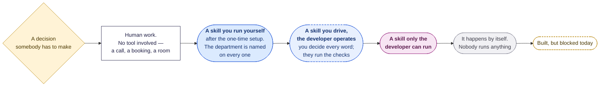

**Blue means you can run it.** Marketing generates its own posters, Comms sends
its own email, and anyone can fix a typo on the slides — as many versions as it
takes, without waiting for anybody. The one-time setup is
`docs/development/AI_SKILLS_GUIDE.md`: an afternoon, no programming, and an
admin has to hand you two keys.

**You do not have to remember any command.** Every blue and magenta box below
carries **the sentence you type into Cursor**, in quotation marks. Copy it,
change the event name, press Enter. The tools are written to be asked for in
plain English — you can also just say what you want and it will work out which
one you mean.

**Magenta is not a rank.** It means the step needs something one person holds:
a storage token, a media tool, or — for the Slack sync — responsibility for a
private archive that has to move in the same operation.

**Dashed blue is the middle case**, and today it applies to one thing: building
a deck from scratch. The person who knows what the evening is about decides
every word, every photograph and every ordering; the developer runs the
four-screen preview and opens the pull request, because there are no preview
deploys. *Changing* a deck that already exists is not this — that is blue, and
anybody can do it.

### Three questions before you do anything

Most confusion on this team is one of three jobs being mistaken for another.

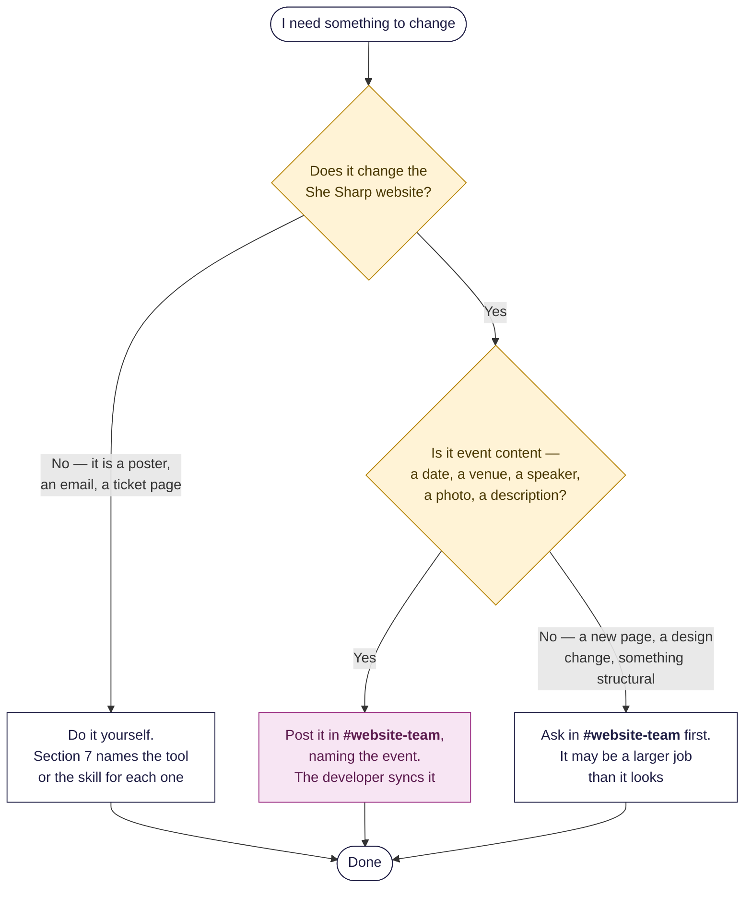

**Never send a website change as a direct message.** Section 5 explains why in
one diagram. A DM is invisible to the tooling that finds work, and it has cost
this team real misses.

---

## 1. One event on one page

The whole thing, from the first conversation to the newsletter. Every box says
what the step is, which skill does it if a skill does, and who runs that skill.
Where two boxes sit side by side, that work happens at the same time.

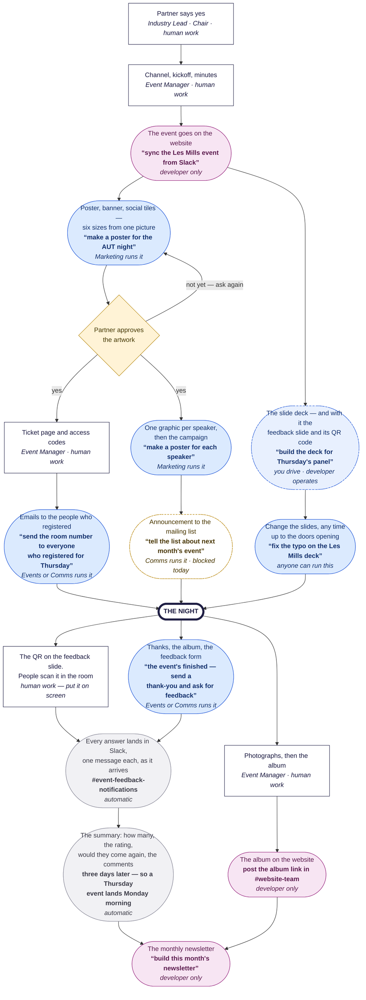

Reading the colours across the whole run: **five boxes are human work with no
tool at all**, five are **skills the team runs for itself**, three are **the
developer's**, one is **joint**, two **happen by themselves**, and one is
**blocked**. Every step that produces something people see — the artwork, the
campaign, the emails, a last-minute fix to the slides — is one the team can run
without waiting for anybody.

**The feedback loop is the part nobody has to set up.** The form and its short
link exist from the moment the event is on the website; the deck puts the QR on
the screen; every answer arrives in `#event-feedback-notifications` as a
separate Slack message with the rating in the header, so a whole week is
scannable down the channel; and the summary posts itself. Nothing in that chain
is anybody's job.


### Four things worth reading twice

**The loop on the poster is the point, not a failure.** Asking again is cheap:
four candidate pictures, pick one, and all six sizes rebuild in a minute.
Marketing is expected to produce v2 and v3 rather than defend v1, and nobody has
to be asked for permission. The same is true of the slides right up to the hour
before the doors open, and of the announcement copy until the moment it is
scheduled.

**The partner's approval is on the critical path, and it is not ours.** The
ticket page and the whole campaign sit downstream of somebody else's inbox. That
single dependency is behind most of the lateness described in section 3.

**Everything the website says comes out of the channel and the run sheet.** A
fact that is not written down in one of those two places does not reach the page,
however many people know it. That is also why `/sync-event-from-slack` sits early
and is the developer's: it is the one step that moves the private Slack archive
at the same time, and those two have to stay level.

**Marketing reads the event's facts off the website**, not out of a message —
which is why the poster step sits after the page step and not beside it. That
ordering is what stops the poster and the page disagreeing.

The mailing-list announcement is drawn with a dashed border because it is built
and **cannot complete today**; section 7 explains why, and what happens instead.

### What to type, and who types it

You never have to remember a command. Open Cursor's chat and say what you want,
in your own words. These are the sentences the tools were written to recognise —
copy one, change the event name, and press Enter.

| What you want | Type something like this | Who does it |
|---|---|---|
| Find out what is still outstanding | *"what's left to do for Thursday's panel"* | **anyone** |
| A poster, a Humanitix banner, social tiles | *"make a poster for the AUT night"* | **Marketing** |
| A different version of the artwork | *"try it again with a darker picture"* | **Marketing** |
| One graphic per speaker, plus the line-up | *"make a poster for each of the speakers"* | **Marketing** |
| Email the people who registered — reminders, the room number, the thank-you | **not here.** Humanitix -> Email campaigns | **Events or Comms** |
| Tell the mailing list about an event | *"tell the list about next month's event"* | **Comms** · blocked today |
| See or update who is on the mailing list | *"who's on our email list?"* | **Comms** |
| Answer the people who wrote to us | *"who hasn't been replied to yet?"* | **Comms** |
| **Fix something on slides that already exist** | *"fix the typo on the Les Mills deck"* | **anyone** |
| Build a deck from scratch | *"build the deck for Thursday's panel"* | **you decide the content, the developer operates** |
| Put an event on the website, or change one | post it in **`#website-team`** instead | **developer only** |
| This month's newsletter | *"build this month's newsletter"* | **developer only** |

If you would rather use the exact command, every row above maps to one:
`/run-event-playbook`, `/make-event-poster` (with `--speaker all --lineup` for
the second and third rows), `/promote-event`, `/update-mailing-list`,
`/reply-to-contact-messages`, `/tweak-event-slides`, `/build-event-slides`,
`/sync-event-from-slack`, `/monthly-newsletter`. You do not need them. The plain
sentence is the supported way in. The one row with no command is the registrant
email: no sentence reaches it, because nothing here sends it.

**Two warnings that go with the two easy ones.**

*Changing slides is live immediately.* `/tweak-event-slides` puts your change on
the real website in about five minutes, with nobody reviewing it and no undo button.
That is the whole point of it an hour before the doors open, and it is why it
only ever makes **one small change** — a word, a photograph, a name. Anything
larger goes back through building the deck properly.

*Sending email cannot be recalled.* Every sending tool stops and shows you a
plan first. **Read it, because it is the only chance you get.** Nothing on this
path is scheduled any more — the Resend broadcast product was retired, and a
send now happens the moment a human runs the printed `resend emails batch`
command, chunk by chunk. There is no cancellation window and nothing to call
back. The plan block before the send is the safeguard; there is no second one
after it.

Setting yourself up takes an afternoon and no programming:
`docs/development/AI_SKILLS_GUIDE.md`, which also covers the step this document
does not — how the files a skill writes on your computer get back to everybody
else. Ask an admin for the `.env` file and a full-access Resend key before you
start; those are the only two things you cannot do for yourself.


---

## 2. The timetable

### At a glance

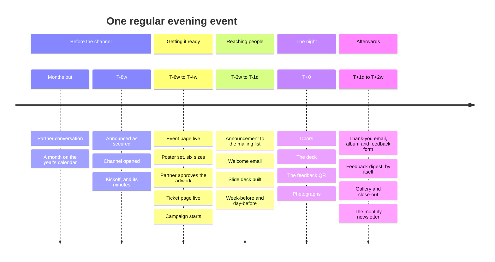

### In detail

The bars are relative. Day 0 below is a placeholder — slide the whole chart onto
your own event date and the distances still hold.

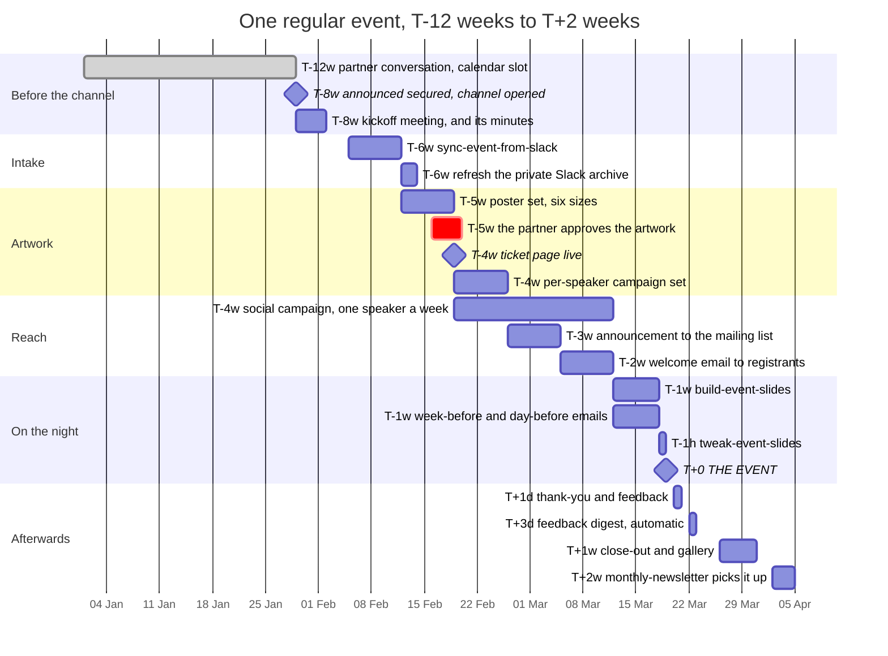

Only one bar is marked critical, and it is the one nobody on this team controls:
**the partner approving the artwork**. Everything downstream of it — the ticket
page, the campaign, the announcement email — waits.

### When the notice is short

**Nothing in the pipeline requires eight weeks.** An event booked three weeks out
skips nothing; it does the first four rows in one afternoon, in the same order.
What cannot be compressed is the two steps that wait on somebody else: the
partner approving the poster, and the speakers sending their bios and
photographs. Start both on day one, whatever the notice.

---

## 3. Phase 0 — before there is a channel

Everything above starts at "a Slack planning channel exists". This section is
what happens before that, and until now it was written down nowhere.

It is reconstructed from what the organisation's own records show actually
happened across the 2026 events, and it is deliberately written as **process, not
case study** — no amounts, no named negotiations, no individual's comings and
goings. Steps marked ⚠️ are ones the records do not settle; treat them as a
question for the next team meeting rather than as a rule.

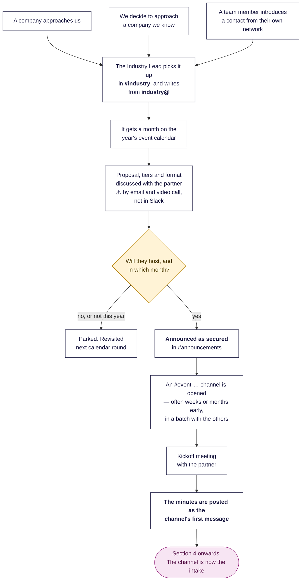

### Where a partner comes from

Three routes, all of which end in the same place:

1. **They write to us.** Usually to the Chair directly, sometimes to
   `industry@shesharp.org.nz`, which is the address printed on the sponsorship
   page.
2. **We go to them**, because last year's event with them worked and the team
   agreed in a Monday meeting to ask again.
3. **A team member knows somebody.** The convention here is worth stating,
   because it was argued out explicitly: the team member does **not** ask their
   contact to email us. They pass the contact to the industry team, and the
   industry team reaches out with a proposal. Making a warm contact do the
   paperwork is how a warm contact goes cold.

**`#industry` is the origination channel**, without exception. The Industry Lead
owns first contact and follow-up; the Chair approves, and in practice often holds
the relationship personally.

### How a month gets chosen

The year is planned, not improvised. A **strategy day in January** sets the shape
of the year, and the **Monday evening team meeting** is the standing forum where
event slots are confirmed, roles assigned and dates checked. There is a **year
event calendar** — a shared spreadsheet, pinned in `#industry` — which the Chair
arbitrates when two partners want the same month.

One constraint gets forgotten and should not be: **the university exam
timetable**. A large share of the audience is students, and an evening in the
middle of exams is an evening with an empty room.

### The moment it becomes real

There is no form, no vote and no written approval. What there is, and what the
whole team can recognise, is a **"secured" announcement** posted by the Industry
Lead. It is the de-facto green light, and it is only a green light when it
carries all five of these:

| The announcement must say | Because |
|---|---|
| The **date** — day, month, start and finish | Everything downstream is dated from it |
| The **venue** | Usually the partner's own office |
| **Who is feeding the room** | Almost always the host; it is the largest cost |
| **Who is speaking**, or that the host will supply speakers | Determines whether the Chair has to find them |
| The **host's ticket allocation** | The host invites its own people, and those seats are not for sale |

An announcement missing one of those five is not a green light; it is an
intention. Say so in the channel rather than starting the poster.

⚠️ **How a partner converts from "interested" to "confirmed for month X" is not
recorded anywhere.** It happens by email and video call. The team sees the
outcome, never the conversation — which is fine, until somebody needs to know why
a date moved.

### Who pays for what

She Sharp's regular evening events run on a **host model**, and the split is
consistent enough to plan against:

| The host provides | She Sharp provides |
|---|---|
| The venue | The poster set and every other piece of artwork |
| Catering for the expected number | The ticket page and the access codes |
| One to three speakers from its own staff | The event page on the website |
| Its logos, and brand approval on the artwork | The slide deck |
| A short blurb and the event title | Printing, name badges, gifts and giveaways |
| A block of complimentary tickets for its own invitees | Photography, the album and the write-up afterwards |

Sponsorship itself is **tiered**, and the current tier table is owned by the
Industry Lead — it changes year to year, so read it from them rather than from an
old deck. Annual sponsors each receive a small block of complimentary tickets to
every event, separate from the host's own allocation.

Regular evening events are **ticketed at a nominal price**, typically a student
rate and a professional rate, alongside several zero-priced blocks: the host, the
annual sponsors, She Sharp ambassadors and their guests, and university clubs.
Some programmes — a funded series run for a partner agency, for instance — are
**free and invite-only**, and are deliberately not promoted to the public list at
all.

Money leaves the organisation through the Chair. **Any spend needs her approval
before it is committed**, invoicing is centralised on her deliberately, and
reimbursements are paid by bank transfer against a receipt. `industry@` is the
live sponsorship address; the finance mailbox has no standing reader, so do not
route anything that needs an answer to it.

⚠️ **Nobody is recorded setting the ticket price.** It is stable year to year and
appears to be inherited rather than decided. Worth confirming who owns it before
the next season.

### The speakers

**The host supplies them**, from its own staff, and the objective is a panel that
shows the same technology through different roles rather than three engineers.
When the host cannot deliver, the fallback is the Chair's network, and that
fallback is used often enough to plan for.

Every speaker has to supply four things, and the character limits are real
because the artwork and the page are built to them:

| What | Limit | Used by |
|---|---|---|
| Biography | **750 characters including spaces** | The event page |
| Role or job title | **50 characters including spaces** | The poster, the page, the deck |
| A headshot | portrait, as large as they have | The speaker graphic and the page |
| LinkedIn URL | — | The event page |

**They go into the Speakers tab of that event's run sheet**, not into a Slack
message. The events lead for that event chases them.

**Budget three to four weeks for this, and expect it to run late anyway.** It is
the single most reliable source of lateness in the whole pipeline. A speaker
graphic cannot be built without a headshot, and using somebody's LinkedIn photo
because theirs never arrived is a compromise, not a solution.

### The ticket page

Ticketing is on **Humanitix**, and the account login is the shared `events@`
mailbox. The page is built by whoever on the events team owns that event's
logistics, roughly four to seven weeks out.

**The ticket page is blocked on the artwork.** It needs the poster and a banner
at **3200 × 1600 px, under 10 MB** — which is exactly why `humanitix.jpg` is one
of the six sizes the poster pipeline produces. A draft description can go up
before the final copy arrives, but the page does not go live without the picture.

Access and discount codes are created inside Humanitix by the same person, one
block per sponsor plus blocks for the team, guests and university clubs. They are
posted into the event channel and pinned.

> **Codes never leave Slack and Humanitix.** Not into the website, not into an
> email, not into a slide. A registration code published on an event page in June
> 2026 cost a rewrite of the repository's history and the rotation of every code.
> This is the one rule in this section with no exceptions.

**Turn on the mailing-list opt-in before the page goes live.** In Humanitix:
*Edit Event → Advanced → Settings → Orders → "Enable host's mailing list opt
in"*. It is a **per-event** switch and it defaults to **off**, so it is lost by
omission on every new event unless somebody sets it.

**"Before the page goes live" is the whole instruction, and the September 2026
event is what it cost.** That page opened on **2026-08-04**; the switch was not
turned on until **2026-08-26**. **34 orders were placed in between, and not one
of those buyers was ever shown the question.** They are not non-consenters — they
were never asked, which is a different and unfixable thing: Humanitix keeps no
history to go back for and there is no honest way to ask retrospectively. Turning
the switch on late does not recover them. This is the cheapest step in the entire
lifecycle and it is worth thirty-four people.

**The switch has been off since May 2022, and it was turned back on for the
September 2026 event.** This paragraph twice said something weaker than the
evidence supports — first that the switch had certainly been off (asserted from a
frozen archive), then, after that was withdrawn, that two readings survived and
nothing in this repository could separate them. The file that separates them was
already in the vault; nobody had opened it.

**Measured 2026-08-30** from
`private/humanitix/2026-08-17/order-report-(exported-2026-08-17@09.59.31).csv` —
the console's **reports → orders → Export CSV**, 4,145 orders, 43 columns,
column `Marketing opt-in`:

| Order year | No | Yes |
|---|---:|---:|
| 2020 | 468 | 137 |
| 2021 | 247 | 47 |
| 2022 | 627 | 40 |
| 2023 | 730 | **0** |
| 2024 | 856 | **0** |
| 2025 | 471 | **0** |
| 2026 | 522 | **0** |

**224 Yes, 3,921 No, and not one blank cell in the file.** The column did not
lapse: it is populated on every order through to the export date and it reads
`No` for all 2,579 orders from 2023 onward. Reading 1 — "the opt-in has been
collecting all along and only the export column lapsed" — is dead.

**224 is this one export, and it is the right number for this argument and no
other.** Two other totals circulate — **223** from the 2026-08-28 archived API
pull, and **238** from the live API on 2026-09-01 — and they are different
surfaces on different dates rather than a contradiction. The live figure is the
one that moves, because the switch went back on for the September 2026 event, so
**quote 238 (or a fresh reading) for "how many ticks are there", and 224 only for
"did the column lapse between 2023 and 2026"**. `EMAIL_PLATFORM_STATE.md` § "The
2022 question is closed" carries the three side by side.

The API agrees, from a different surface and a different date.
`she-sharp-slack-archive/humanitix/2026-08-28-api/orders/` (59 files, 4,169
orders) has `organiserMailListOptIn === true` on **223** — 2020: 137, 2021: 47,
2022: 38, and **exactly one in 2026**, dated **2026-08-26**, on the Les Mills
event `6a422a2d01e463796c170142`. That one row is the switch being set again for
the September 2026 event, and it is the first tick since **2022-05-30**. **188
distinct people have ever ticked it.**

**Reading 2 is wrong too, but it was closer.** The post-2022 `Mahsa McCauley NZD`
writes into Mailchimp *are* the Humanitix integration — that string is a
Mailchimp **ecommerce store**, `id 5e328b71a912950007fd7f91_NZD`,
with its `email_address` still an `events@` mailbox on the **old `shesharp.co.nz`
domain**, read from
`mailchimp/2026-08-28-api/ecommerce-stores.json`, and Humanitix documents the
store name as *user account name + currency*. Over the 1,549 people now in
`newsletter_subscribers`, **887 carry that source and 886 of them are Humanitix
ticket buyers, while no contact from any other source is a buyer at all.**

What the writes are *not* is evidence of an opt-in. They are the integration's
**"Sync contacts who haven't opted-in"** setting, which was ON until it was
switched off on **2026-08-27** (`../deployment/EMAIL_AUTHENTICATION.md` item 8d).
With that setting on, a buyer who left the box unticked was still written into
the `She#` audience as `subscribed` — which is how **752 of the 1,549** people on
the list today are there for no recorded reason beyond a ticket purchase. The
full tiering is in `EMAIL_PLATFORM_STATE.md` § "How the list was actually
acquired".

**Re-take it with:** the orders CSV above, grouping `Marketing opt-in` by the
year in `Order date` (which is `DD/MM/YYYY`, so take the four-digit group, not
the first four characters); and `organiserMailListOptIn` over the archive's
order files. Both are offline. Neither needs the database.

**What is still not established** is whether every event between 2022-06 and
2026-08 had the switch off, or only that none of them collected a tick. A `No`
in that column is written both when the buyer declined and when the question was
never asked, and Humanitix exposes no per-event record of the setting. For the
purpose of this section the distinction does not matter — either way nobody
consented — but do not quote the column as "3,921 people declined".

**Set the switch on every new event, and set it before the page goes live.** It
costs one click, and four years of events were run without it.

**Turning it on late costs almost as much as leaving it off.** The September
2026 Les Mills event opened for sale on **2026-08-04** and the switch went on
**2026-08-26**: 34 orders were placed before anyone was asked, and those people
cannot be added to the list and cannot be asked again. Everyone asked afterwards
ticked at about 40%, so those 34 orders are roughly thirteen consented
subscribers that no longer exist.

**Verify it rather than remembering it**, once the first orders land and again a
week out:

```bash
npx tsx scripts/humanitix/check-optin-switch.ts            # every upcoming event
npx tsx scripts/humanitix/check-optin-switch.ts --slug <site-event-slug>
```

It enumerates from the live account rather than from this repo's event records,
deliberately — the event whose switch nobody set is precisely the one nobody has
added to the site yet. **One tick proves the switch is on; no number of zeros
ever proves it is off**, so it reports `NO EVIDENCE YET` below ten orders rather
than calling that clean, and it prints the first tick's date beside the first
order's so a late switch shows up as the thing it is.

It matters more than it looks, because it is the only place She Sharp collects a
consent record that is **per person, timestamped, and made by the person
themselves**. `.claude/skills/update-mailing-list/references/consent-rules.md`
allows exactly four consent routes, and a ticked box on a registration form is
route 2; a registration with no opt-in column is not consent, however full the
room was. Every event run with this switch off is a mailing list that could have
grown honestly and did not.

The flag reaches the Humanitix API as `Order.organiserMailListOptIn`. It also
reaches Mailchimp through the live Humanitix integration — but **the integration
does not distinguish on it**, and did not while its "Sync contacts who haven't
opted-in" setting was on, so a Mailchimp contact written by the integration is
not evidence that this box was ticked. Only the orders CSV and
`organiserMailListOptIn` are. See `docs/development/MAILCHIMP_ARCHIVE.md` and
`../deployment/HUMANITIX_INTEGRATION_SHUTDOWN.md`.

Getting those ticks into She Sharp's own consent record takes two steps, and
only the first of them is scripted:

```bash
npx tsx scripts/humanitix/export-optins.ts --slug <site-event-slug>   # dry run
npx tsx scripts/humanitix/export-optins.ts --slug <site-event-slug> --write
# then the two commands it prints, the second of which needs --apply
```

`export-optins.ts` pulls that one event's orders, keeps only the completed
orders carrying a tick, and writes `tmp/humanitix/optins-<slug>-<date>.csv` in
the exact column shape `normalize-recipients.ts` already detects — so the rest
of the chain is unchanged. It reports counts and truncated hashes only, states
how many of the rows are already on the suppression register **before** you run
the import, and refuses outright to write outside `tmp/`. The console's
**reports → orders → Export CSV** still works and is the documented fallback.

**The import is still not automatic, and still should not be.** `--apply`
demands `--event-unsubscribers-checked` because Humanitix keeps a per-event
unsubscriber list that no API and no export reaches — a person has to open the
console and look. That gate is the reason this is two steps rather than one.

**The PII boundary has not moved.** `lib/humanitix/client.ts` still deliberately
implements no `/orders` call, because that endpoint carries names, addresses and
live access codes, and a function that does not exist cannot be imported from
`app/` by mistake. The new capability lives in `scripts/humanitix/orders-api.ts`
— under `scripts/`, which nothing in `app/`, `lib/` or `components/` imports —
and it reads the endpoint through a **required** field allowlist, so the access
code and the postal address never enter the process at all.

### The channel, and its first message

Two things about `#event-…` channels surprise people:

**Channel creation is batched to the calendar, not to the partner.** Several are
often opened in the same few minutes, weeks or months before there is anything to
put in them. A channel that has existed for a month with two messages in it is
not a stalled event; it is a placeholder.

**Whoever opened the channel is not necessarily the owner.** The owner is whoever
runs the kickoff and posts the minutes.

**The canonical first substantive message is the kickoff meeting minutes**, and
they have a settled shape. Reproducing it is the single most useful thing an
organiser can do for everyone downstream:

```
Event Date / Time
Theme
Title
Format
Proposed Agenda
Discussion Topics

She Sharp Action Items
  - …

<Partner> Action Items
  - Provide speaker bio (750 characters including spaces), role (50 characters
    including spaces) and photos
  - Share logos for marketing materials
  - Plan catering for approximately N attendees
  - Provide a 1–2 paragraph event blurb
  - Confirm the venue address
```

Those minutes are what the sync reads. Every fact in them ends up on the website;
every fact missing from them has to be chased twice.

### Two sources of truth, at two different times

This looks like a contradiction and is not.

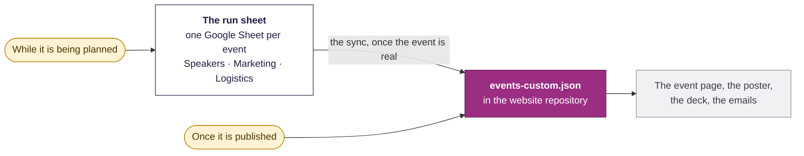

**While an event is being planned, the run sheet outranks Slack.** A time
discussed in a message three weeks ago and a time in the run sheet today are not
equal, and the run sheet is the one to believe.

**Once the event is published, `events-custom.json` outranks everything**,
including the run sheet — because the poster, the deck and the emails are all
built from it, and section 4 explains what happens when they are not.

### What goes wrong here, every time

Ten things, in rough order of how often they bite. None of them is anybody's
fault; all of them are predictable enough to plan around.

1. **The blurb and the title arrive last.** Nothing — poster, page, ticket
   listing — can be finished without them, and they are the partner's to write.
   Ask for them in the kickoff, in writing, with a date.
2. **The artwork gets reworked for partner branding.** An old logo, a brand
   guideline nobody mentioned, or a house style that will not sit with the theme.
   Budget one revision round as normal, not as a failure.
3. **The partner never actually picks an option.** Silence is not approval; if
   they respond to one option without choosing it, ask the closed question.
4. **Speaker headshots and bios are late**, and sometimes still missing two weeks
   out. See above.
5. **The venue address is an action item that nobody closes.** It is on the
   kickoff list precisely because it gets forgotten, and it ends up on a public
   page and in a day-before email.
6. **Dates move.** Roughly a third of events show a date discrepancy at some
   point between the announcement, the ticket page, the poster and the website.
   When it moves, say so in the channel and fix `events-custom.json` first —
   section 4.
7. **The partner's contact person changes mid-planning**, and everything
   dependent on them stops at once: catering, room booking, giveaways, badge
   printing. Ask early who the backup contact is.
8. **We have single points of failure too.** One designer carries the whole
   poster queue. When their availability drops, everything slips together.
9. **Four surfaces drift apart** — the slide deck, the poster, the website and
   the ticket page all state the time, and four different people update them.
   Section 4 is the answer to this, and it only works if it is followed.
10. **Marketing hears about the event later than it should.** They need the
    facts before they can start, and they are often told after the ticket page is
    already wanted. Bring marketing into the kickoff.

---

## 4. The one rule everything else follows

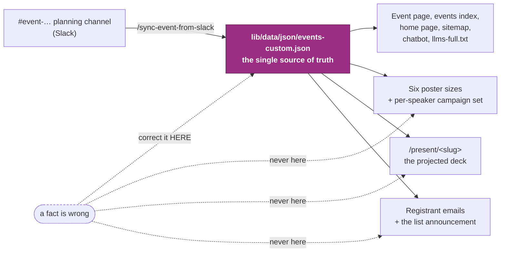

The event record is the source; everything else is a view of it. The deck reads
it live, the poster reads it at build time, and the emails read it through
`scripts/events/resolve-event.ts`. So **a correction goes into the record and
every artefact follows** — and a fact typed straight into a deck or a poster to
save a step is a fact that will one day contradict the event page nobody thought
to re-check.

This is the answer to problem 9 in the list above, and it is the only answer
there is. **Fix the record, rebuild the artefact.** Never the other way round.

Corrections touch `detailPageData` only. Never `id`, never `slug`: the slug is
the public URL, the deck route **and** the feedback QR code all at once.

---

## 5. How a change reaches the website

This is the part most of the team touches most often, and it has one rule:
**post it in `#website-team`.**

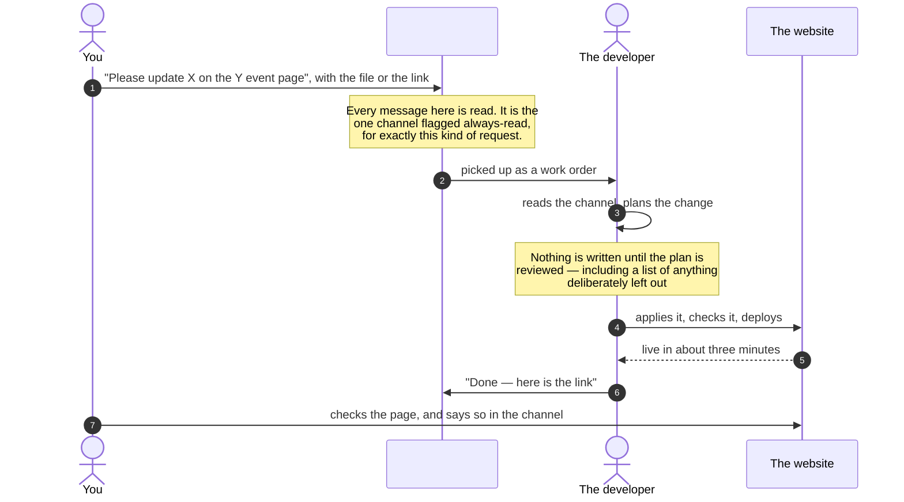

### What a good work order looks like

Four things. It takes a minute and saves a round trip.

- **Which event.** By name or by date. "The Xero one in October", not "the event".
- **What should change**, in the words that should appear. If it is a person's
  job title, write the job title.
- **The material**, attached — the headshot, the run sheet link, the PDF.
- **When you need it by.** "Before the poster goes out on Friday" is useful;
  "ASAP" is not.

### Why not a DM

Because the tooling cannot see one. Website work arrives in a workspace of two
hundred conversations, and it is found by looking for the signals of an event —
a venue, a date, a ticket link. A message reading *"please update Carolina's
profile on the website"* carries none of those and scores zero. It is invisible
precisely because it is a small, ordinary, reasonable request.

`#website-team` exists so that class of message has somewhere to land where it
will always be read. That is why the rule was set on **6 August 2026** and why it
has been restated since. It is not bureaucracy; it is the difference between your
request being actioned and your request being lost.

### Why the sync is the developer's job

Two reasons, and only the second one is about permissions.

1. **The sync moves two repositories at once.** The public website repository
   gets the event; a separate, private archive gets the verbatim record of the
   Slack conversation behind it. They have to move together or they drift, and
   the archive is governed as one dataset by one person so that "who read what,
   and when" always has an answer.
2. It needs a Slack token, and the archive holds material — attendee
   spreadsheets, live ticket codes, private messages — that must never reach a
   public repository. **Carry the fact, never the text.**

Everything else in this document is open to anyone who wants to learn it.

---

## 6. Who does what

Names are here so that a new volunteer knows who to ask; the role beside each
name is what actually makes the row true, so when somebody moves on, the row
survives them. Where the published title and the observed practice differ, the
row says so with a ⚠️ rather than quietly picking one.

The last column says **how** the work gets done: `human work` when no tool is
involved, a skill name when one is, and `joint` where a non-technical colleague
decides the content and the developer operates the tooling. The same split is
drawn in colour in section 1, and listed skill by skill under it.

### By phase

| Phase | Who leads it | Who else is in it | How it gets done |
|---|---|---|---|
| Finding and securing a partner | **Industry Lead** — Meeta Patel, Prasanth Pavithran | **Founder and Chair** — Mahsa McCauley, who approves and often holds the relationship | human work |
| The year's calendar and the go/no-go | **Founder and Chair** — Mahsa McCauley | The whole team, in the Monday meeting | human decision |
| Opening the channel, the kickoff, the minutes | **Event Manager** for that event — Nikita Kumari, Nirmala Chinnappan, Moksha Shah | **Events Coordinator** — Tharaneetharan Thavarasan | human work |
| Chasing blurb, title, bios, headshots | **Event Manager** for that event | — | human work |
| The ticket page and the access codes | **Event Manager** for that event | Login is the shared `events@` mailbox | human work |
| The event page on the website | **Website Team Lead** — Chan Meng | Requests come from anyone, via `#website-team` | `/sync-event-from-slack` · **developer only** |
| Poster set and all artwork | **Marriane Bentigan** — Marketing Lead, and the one who makes the artwork | **Gurleen Kaur** — Content Creator; design and video support | `/make-event-poster` · **Marketing runs it** |
| The campaign calendar and coordination | **Len Estioko** — Marketing Lead; owns the run sheet's Marketing tab | **Sara Ghafoor** — Marketing Lead | human work |
| Posting to social | **Sara Ghafoor** — Marketing Lead; social media | **Lesley Gao** runs RedNote | human work |
| Email to the mailing list | **Len Estioko** — Marketing Lead; holds the current mailing platform | See section 7 for why the new path is blocked | `/promote-event` · **Comms runs it** · blocked |
| Email to people who registered | **Events or Comms** — whoever has the Humanitix login | Nikita Kumari, Nirmala Chinnappan, Moksha Shah, Len Estioko, Sara Ghafoor | Humanitix → Email campaigns · **not this repo** |
| The slide deck | **Whoever is running the evening** decides every word; **Chan Meng** operates the tooling | Len Estioko has built decks too | `/build-event-slides` · **joint** |
| A change to the slides, any time up to the doors | **whoever spots it** | Live in about five minutes, with nobody reviewing it | `/tweak-event-slides` · **anyone runs it** |
| Photography on the night | **Mike McCauley** — Finance and Assets Manager | Anyone with a phone; see the rule below | human work |
| Badges, gifts, printing, gear | **Mike McCauley**; **Moksha Shah** sources merchandise | Paid or reimbursed through the Chair | human work |
| The album | **Event Manager** for that event | Screened against the photography rule below | human work |
| The gallery and close-out | **Chan Meng**, from the album link posted in `#website-team` | — | `build-event-archive` · **developer only** |
| The feedback digest | nobody | It posts itself three days after the event | **automatic** |
| The monthly newsletter | **Tharaneetharan Thavarasan** prepares the content; **Chan Meng** runs the send | Live sends still go through the current platform | `/monthly-newsletter` · **developer only** |
| Answering people who write in | **Sara Ghafoor** reads `info@` | Outside the event pipeline, but it is where event questions land | `/reply-to-contact-messages` · **Comms runs it** |

**Website engineering** is Chan Meng (Website Team Lead) with Lesley Gao, who
designs and opens changes directly, and Yesha Kaniyawala.

**Marketing has three leads**, and they divide the work rather than duplicate
it: Marriane Bentigan makes the artwork, Sara Ghafoor posts it, and Len Estioko
coordinates the calendar and the email. Ask the one whose half you need.

**Mentorship** sits outside this document. ⚠️ It is run in practice by Len
Estioko through `mentoring@`, though no title on the site says so.

### Role cards

**If you are an Event Manager**, you own the channel, the kickoff minutes, the
chasing, the ticket page, the room on the night and the album. You hand the
website the facts through `#website-team` and hand marketing the facts through
the run sheet's Marketing tab. Your mailbox is `events@`.

**If you are on Marketing**, you own the artwork, the campaign calendar and every
post. You read the event's facts off the website, not out of a message — that is
what stops the poster and the page disagreeing. You never add anyone to a mailing
list; section 7 explains why that is not a judgement call.

**If you are the Industry Lead**, you own first contact, the proposal, the tier
table and the sponsor ticket allocations. Your mailbox is `industry@`, and it
currently has no standing reader — worth fixing before the next season.

**If you are the developer**, you own everything that writes to the repository and
both Slack read positions, and you are the only route by which anything from the
private archive may be quoted — as a fact, never as text.

**If you are new, do not start here.** `/internal/event-playbook` is one page
that tells each team which part of this is theirs and the exact words to type;
`docs/development/AI_SKILLS_GUIDE.md` is the setup walkthrough behind it. This
document is the reference the two of them are built on.

### One rule that binds everybody

**Do not publish a photograph in which a child is the identifiable subject**, and
never name a child — in copy, in a caption, in `alt` text or in a credit. A child
inside a wide group shot is not that. Youth events run under the host school's
media consent and have their own procedure, not an exemption. Screen at
selection, not afterwards: images are cached for a year and the public album
lives outside the repository, so removal is a code change plus an album edit.
The full rule is `docs/development/PHOTOGRAPHING_MINORS.md`.

---

## 7. Promotion

### The beats

An event goes on sale weeks out and fills in the last ten days. Posting the same
picture five times trains people to scroll past it. So the campaign accumulates:
same link, same date, same venue, a new face and a new reason each time.

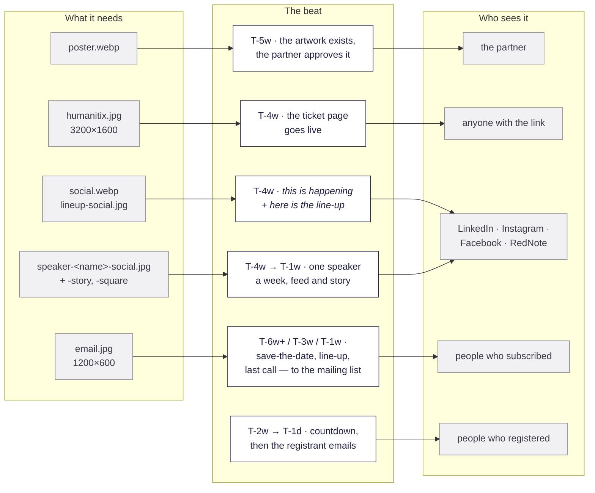

Two or three email sends per event is the norm, and the social campaign runs one
speaker a week alongside them. Posts are drafted and scheduled ahead — a whole
event's campaign is normally built in one sitting and scheduled out, not posted
day by day.

**The mailing-list half of that does NOT work like the social half.** There are
three stages (`/promote-event --stage save-the-date | line-up | last-call`) but
they cannot be built in one sitting and scheduled out: there is no scheduler
anywhere in the send path, each stage needs its own approval at its own moment,
and `/email-the-community` refuses a fourth marketing send to the list in one NZ
calendar month — the monthly newsletter counting towards the same three. So a
three-stage campaign whose stages land in one month leaves no room for the
newsletter; spread the stages, or drop one.

### The artwork, and where each piece goes

`/make-event-poster` builds six sizes from one picture. Each is its own design,
not a crop of the others.

| File | Size | Where it goes |
|---|---|---|
| `humanitix.jpg` | 3200 × 1600 | The ticket page banner. JPEG because Humanitix rejects WebP |
| `social.webp` / `.jpg` | 1080 × 1350 | LinkedIn, Instagram, Facebook — **and the website's cover image** |
| `story.webp` / `.jpg` | 1080 × 1920 | Instagram and Facebook stories |
| `square.webp` / `.jpg` | 1080 × 1080 | The square Instagram grid tile |
| `poster.webp` | 1400 × 1980 | The event page and print. The only one carrying the street address |
| `email.jpg` | 1200 × 600 | **Nothing to upload** — the announcement email picks it up itself |

Plus, per person: `speaker-<name>-social.jpg`, `-story.jpg`, `-square.jpg`, and
one `lineup-social.jpg` for the whole panel.

### Making a poster

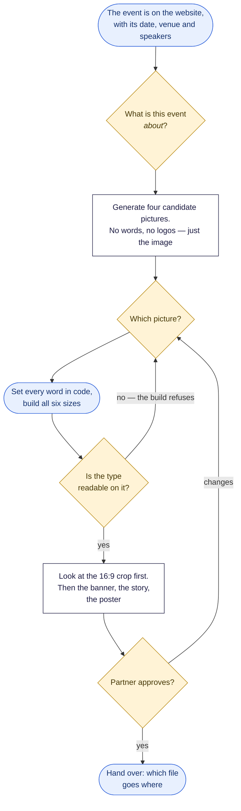

Three things about that loop are deliberate and worth knowing before you argue
with it:

- **The picture and the words are made separately.** Ask an image generator for a
  poster and you get invented signage — the right shape from three metres and
  gibberish from one, and impossible to correct when the venue changes. Type set
  in code is exact, re-runnable and identical across all six sizes.
- **The facts come from the event record, never from the person asking.** If a
  fact is wrong, it is fixed in the record first — section 4 — because it is
  wrong on the public page too.
- **The legibility check is enforced, not advisory.** The build refuses rather
  than shipping something nobody can read from the back row. There is a flag to
  inspect a failure; there is none to ship past one.

Each speaker graphic carries a **hook** — one line, nine words maximum, a claim
rather than a summary, written by a person and never lifted from the first
sentence of the bio. And the face is always that speaker's own headshot from the
event record. "No photograph in the record" is a refusal, and the fix is a
photograph, not a substitute.

### Who may receive what

This is the part of the whole document where a well-meant mistake does real
damage, so it is a decision tree rather than a paragraph.

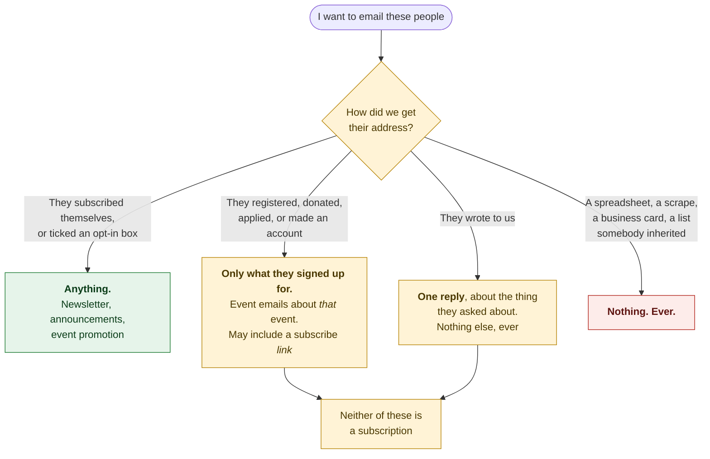

**Somebody who bought a ticket agreed to hear about that event.** They did not
agree to a newsletter. The same goes for people who donated, applied for
mentoring, or wrote in. The tools refuse this rather than leaving it to judgement
— and **that refusal is the tool working correctly, not a bug**.

The list grows two ways and no others: somebody subscribes themselves, or
somebody ticks an opt-in box on a form they were filling in anyway and that tick
is recorded with the question and the date. "They would probably want it" is not
a route. The binding version is
`.claude/skills/update-mailing-list/references/consent-rules.md`, and every
sending skill defers to it.

An unsubscribe is permanent and applies everywhere. Somebody who unsubscribed in
March and registered for an event in July has not resubscribed.

### Sending the announcement

⚠️ **This path is built and cannot complete today.** The subscriber list that
actually receives the newsletter still lives on the old platform; the new one
holds essentially nobody, and no announcement has ever been sent through it. The
skill says so up front rather than failing confusingly. Until the list is
migrated, the announcement goes out the way it always has.

When it does run, the shape is worth knowing because it is what makes an
irreversible action safe:

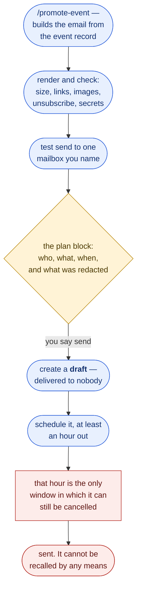

Two habits that go with it: schedule for a sensible New Zealand hour rather than
whenever you happen to be working, and always schedule an event announcement to
land **before the event**.

---

## 8. On the night

One page for whoever is clicking.

- Open `/present/<slug>` **ten minutes early**, wait for the loading chip to
  disappear, then **do not reload**.
- `L` stops all motion. The deck still looks right standing still; use it on an
  old venue laptop that stutters.
- Take the **PDF backup** — add `?print=1` to the URL and print to PDF. It
  survives dead venue wifi and a laptop that will not talk to the projector.
- Paste the feedback link in plain text into the venue chat and into the
  thank-you email: `shesharp.org.nz/f/<code>`. Everyone who was looking at their
  phone when the QR was on screen, or who left early, can still answer.
- A last-minute copy change is `/tweak-event-slides`, not a hand edit — live in
  about five minutes.
- Photographs: the rule in section 6 applies from the first frame, not at
  selection time. It is easier not to take the picture than to explain later why
  it was published.
- If the site is ever put into maintenance mode, the **feedback form goes down
  with it**, `/f/*` included. Worth knowing before you point a room at a QR code.

---

## 9. After the night

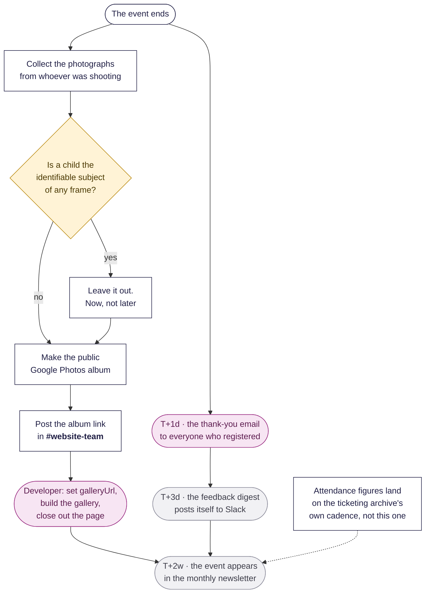

### The thank-you email, and what goes in it

Sent one or two days after, to the people who registered. Its contents are
already settled, and they are worth knowing before anyone asks for something
extra:

- **A real sentence about this event** — a moment, a speaker, the actual room.
  Generic thanks reads as automated, because it is.
- **One button: the feedback form.** Exactly one, and this is it.
- **The photo album, as an inline link**, once it exists. Omitted if it does not.
- **An invitation to join the mailing list — as a link they choose to click.**
  Nobody is added because they came.
- The venue and date, and the line saying why they are receiving it.

**There is deliberately no promotion of the next event in it.** A second button
makes both buttons perform worse and trips the single-call-to-action check, and
these people have not subscribed to anything — they registered for the evening
that has just finished. The next event reaches them through the mailing list they
have just been invited to join. If that feels like a missed opportunity, the fix
is to make the invitation good, not to add a second button.

### The feedback that arrives by itself

Nothing to run, and nothing to set up. The form and its short link
(`shesharp.org.nz/f/<code>`) exist from the moment the event is on the website;
building the deck is what puts the QR on the screen.

Two things then happen in **`#event-feedback-notifications`**, both on their own:

1. **Every answer arrives as its own Slack message**, as it is submitted, with
   the rating in the message header — so a whole week is scannable straight down
   the channel without opening anything.
2. **A summary posts three days after the event**: how many responses against
   how many attendees, the mean rating, the recommendation score,
   would-they-come-again, and all the free text. For a Thursday evening event
   that lands **Monday morning, New Zealand time**, which is usually the first
   time anybody looks.

Three days is deliberate — long enough for the late responses, short enough that
the event is still fresh enough to act on. **Zero responses posts a "nothing came
in" note rather than staying silent**, because silence is indistinguishable from
a broken job, and it usually means the QR never went up.

Someone ticking "keep me posted" on the feedback form is **not** consent to add
them to the list. It is a signal to surface, and they still have to be imported
through the consented route in section 7.

### The gallery

Post the album link in `#website-team` and the developer does the rest: the album
appears on the public photo gallery page, and a handful of photographs are
harvested onto the event's own page.

Two things to know: a hand-picked photograph goes **beside** the harvested set,
never inside it, because the harvested folder is wiped and rebuilt every time.
And an event needs at least two distinct photographs before the gallery build
will touch it.

### The attendance figures

**These do not land at close-out and there is no one-liner.** They come out of
the ticketing archive, which is rebuilt on its own schedule, matched to events by
hand, and signed off by a person before anything reaches the public page.

One trap that has caught people twice: **a check-in count of zero usually means
nobody scanned**, not that nobody came. Many ticketed events never ran a scanner
at all. Never publish a zero as attendance.

### The newsletter

Roughly a fortnight after, the event goes into the month's issue: the
photographs, a paragraph, and the link. That is the last thing that happens to an
event, and it is the point at which `event-status.ts` should show nothing
outstanding.

---

## 10. Which mailbox

Every address, and what it is for. Two categories, and confusing them causes real
problems: addresses people are invited to write **to**, and identities the site
sends **as**.

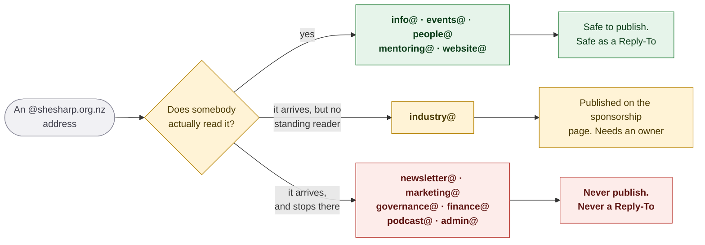

**Do not publish an address from the red group, and never make one a
Reply-To.** Mail sent there arrives and then stops. Seven further addresses were
published on this website for a year and had never been created at all — every
message to them bounced, including one from the head of a partner organisation
who mentioned the bounce in the contact form. The full account, and the audit
that settled it, is `docs/development/EMAIL_ADDRESSES.md`.

Which address goes on what:

| The conversation | The address |
|---|---|
| A sponsor or a potential partner | `industry@` |
| Someone asking about a specific event | `events@` |
| Someone who wants to volunteer | `people@` |
| Anything about mentoring | `mentoring@` |
| Anything else from a member of the public | `info@` |
| A code-of-conduct report, or a request to take a photograph down | `info@` today ⚠️ *a restricted group is the standing fix* |
| Something broken on the website | `#website-team`, or `website@` |

---

# Part B — running it

## 11. Start here, every time

```bash
npx tsx scripts/events/event-status.ts --slug <event-slug>
```

Offline, read-only, needs no network and no database. It reads seven separate
state sources and prints one checklist, naming the command or skill that closes
every gap:

```
event-lesmills-03-september-2026 — No Pain, All Gain – Getting Fit for AI
  Thursday, 3 September 2026 · 5:00pm – 7:30pm NZST · Les Mills Auckland City · in 11 days

  Slack        done     #event-lesmills-03-september-2026, read to 23 Aug 2026, no backlog
  Event data   done     5 speakers · 1 sponsor · 2 sections · registration link set
  Cover image  done     /img/events/event-lesmills-03-september-2026/cover.webp
  Poster set   done     poster, social, humanitix, email, story, square
  Speaker set  done     4 of 4 speakers + line-up tile
  Deck         done     /present/event-lesmills-03-september-2026 · 25 slides
  Feedback     done     www.shesharp.org.nz/f/l03s26
  Announcement missing  no announcement broadcast has ever been recorded
                        → /email-the-community  (sends to the newsletter_subscribers table)
  Emails       n/a      sent from Humanitix -> Email campaigns; this repo keeps no record of it
  Photos       n/a      the event has not happened yet
```

`--upcoming` (the default), `--all`, `--past [N]`, `--slug` (repeatable),
`--json`. It exits 0 on a report — it is not a gate — and 1 only on a real error.
`scripts/events/event-status.test.ts` runs it in CI against the live repo data,
so a source moving underneath it fails a pull request rather than going quiet.

**`n/a` is not a softer `missing`.** A past event's poster set is not outstanding
work; a past event's photo gallery is.

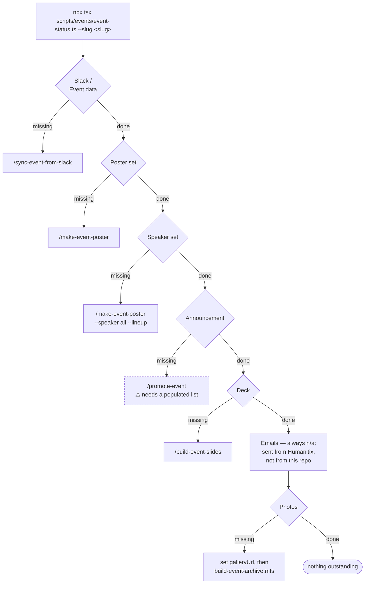

---

## 12. The phases

Each row is **a gate, then a step**. The gate is what must be true before the
step can do its job; running a step whose gate is unmet is how a wrong date
reaches a projector or a poster.

| When | Gate — true before you start | Do this | Who | Kind | Produces |
|---|---|---|---|---|---|
| T-8w | the partner said yes and it was announced as secured | open the `#event-…` channel; run the kickoff; post the minutes | Event Manager | human | the channel, with its first message |
| T-6w | a Slack planning channel with the kickoff minutes in it | `/sync-event-from-slack` | developer | skill | the event in `events-custom.json`, assets in `public/img/events/<slug>/` |
| T-6w | you hold the `she-sharp-slack-archive` checkout — **otherwise skip; the sync is complete without it** | its "Not part of a sync" archive refresh | archive holder | skill | the private archive level with Slack — **committed there, never here** |
| T-5w | date, venue, title confirmed **in the event record** | `/make-event-poster` | Marketing | skill | `poster`, `social`, `story`, `square`, `humanitix`, `email` |
| T-5w | the poster set exists | send it to the partner and get an answer | Event Manager | human | approval, or one revision round |
| T-4w | approved artwork, and a banner at 3200×1600 | build the Humanitix page and the access codes; **switch on the mailing-list opt-in** (per event, defaults off) — before the page goes live, not after | Event Manager | human | a live ticket page |
| T-4w, once the first orders land | the ticket page is live | `npx tsx scripts/humanitix/check-optin-switch.ts --slug <slug>` | developer | script | proof the switch is on, or a `LATE SWITCH` line naming what was already lost |
| T-4w | every speaker has a headshot in the event record | `/make-event-poster --speaker all --lineup` | Marketing | skill | one graphic per person + the line-up tile |
| T-4w → T-1w | the graphics exist | post the campaign, one speaker a week | marketing | human | the campaign |
| T-6w+ / T-3w / T-1w | the mailing list has consented contacts | `/promote-event --stage save-the-date \| line-up \| last-call` → `/email-the-community`, **once per stage** | Comms | **blocked** | up to three batch sends, each separately approved — there is no scheduler, and three marketing sends a month is the cap across every skill |
| T-2w | the event is ticketed on Humanitix, and the sender has access | write the welcome mail in **Humanitix -> Email campaigns** | Events or Comms | **human, outside this repo** | a send recorded in Humanitix's console — **nothing here** |
| T-1w | a run sheet in the event data | `/build-event-slides` | you drive, developer operates | skill | `/present/<slug>` |
| T-7d | agenda, parking and transport known | the week-before mail in **Humanitix -> Email campaigns** | Events or Comms | **human, outside this repo** | nothing here |
| T-1d | room, level or the join link known | the day-before mail in **Humanitix -> Email campaigns** | Events or Comms | **human, outside this repo** | nothing here |
| T-1h | the deck already exists | `/tweak-event-slides` | anyone | skill | self-merged pull request, live in ~5 min |
| **T+0** | — | project the deck; the `/f/<code>` QR is on the feedback slide | whoever is clicking | human | — |
| T+1d | a feedback form URL, the album if it exists, and **under 14 days since the event ended** | the thank-you in **Humanitix -> Email campaigns** | Events or Comms | **human, outside this repo** | nothing here |
| T+3d | — | **nothing — it happens by itself** | — | automatic | the feedback digest in Slack |
| T+3d | the event has stopped selling | `scripts/humanitix/export-optins.ts --slug <slug> --write`, then the two commands it prints | developer, plus a person to read the console's unsubscriber list | script + **human gate** | the event's checkout ticks in `newsletter_subscribers` — **skip an event and those ticks are gone; Humanitix keeps no history to go back for** |
| T+1w | the photo album URL is known | post it in `#website-team`; set `galleryUrl`; `build-event-archive.mts --slug <slug>` | Event Manager, then developer | human + skill | a past-event page with its photographs |
| T+2w | — | `/monthly-newsletter` | developer | skill | the event in the month's issue |
| — | a fresh ticketing export and a signed-off crosswalk | attendance figures | developer | skill | `attendees` and `checkedIn` on the page |

**Four emails about a two-hour evening is too many.** For a single-session event,
a welcome and a day-before note is usually the whole programme, with a thank-you
afterwards. An email nobody asked for is not sent.

**Three constraints ride on those four rows, and none of them is fixable here.**
Registrant mail was sent by a `/send-event-emails` skill until 2026-08-30; it was
retired because it had never sent anything, because the team had been doing the
job in Humanitix for a year, and — decisively — because its only input was a
Humanitix CSV export, so it could serve no event Humanitix's own tool could not.
What that costs, stated plainly rather than discovered later:

1. **The mail no longer comes from `shesharp.org.nz`.** Humanitix campaigns "are
   always sent from the Humanitix email domain"; applying a host profile changes
   the sender *name* only. None of the SPF, DKIM or DMARC work in
   `docs/deployment/EMAIL_AUTHENTICATION.md` applies to it.
2. **There is a 14-day cliff.** "You can send an email campaign to any event that
   has ended within the last 14 days." A gallery or write-up follow-up later than
   that has no tool at all — which is why the T+1d row is a real deadline and not
   a preference.
3. **The tier boundary is unchanged.** Humanitix's own rule is that campaigns
   "cannot be sent to external databases of email addresses, such as for event
   invitations, and should not be used for promotional or marketing material" —
   the same fulfilment-only line `lib/email/audience.ts` draws. Registrants are
   Tier 2 and subscribers are Tier 0, wherever the mail is sent from.

Source for the quotations:
<https://help.humanitix.com/en/articles/8888873-contact-your-guests-using-the-email-campaign-tool>

---

# Part C — for the developer

Nothing below is needed to organise an event. It is the machinery underneath, and
every rule in it exists because it was broken at least once.

## 13. The two read positions, and why they are two

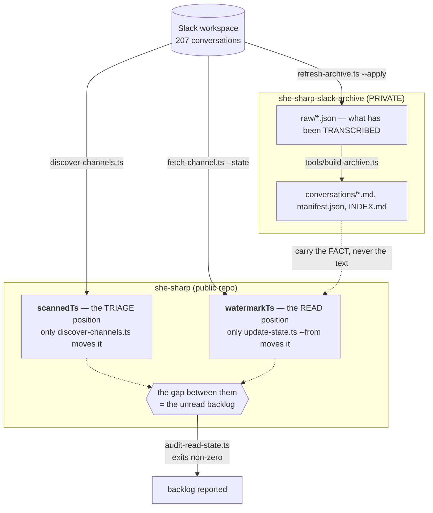

`watermarkTs` means *the model was handed this content*. `scannedTs` means *the
triage glanced at it and scored it quiet*. They were one field for months, which
is why four separate misses happened — including the events lead asking by DM for
a page change, hidden behind a signal heuristic that scored the request at zero
because it named no venue, date or ticket. Section 5 is the human-facing half of
that fix; `#website-team` and its `alwaysRead` flag are the other half.

The archive is a **third**, separate position. Every sync moves the repository's
positions and not the archive's, so it drifts every time. Nothing in any step list
moved it until the sync skill grew a step for it — and all three gates in that
skill's Step 7.5 stayed green throughout, because none of them looks at it.

`refresh-archive.ts` (dry run by default; reads `SLACK_ARCHIVE_DIR`, or takes
`--archive <path>`) is what reports and closes the gap. **It belongs to whoever
holds the archive checkout, not to whoever synced the event** — that was its
mistake until 31 August 2026, when it was a numbered step of the sync with one
person's Windows path written into the command, which made the whole skill
unusable by anyone else. Run it on your own rhythm rather than trusting the three
gates above, none of which can see the archive.

**Nothing from the archive may be copied into this repo.** It holds verbatim DMs,
attendee spreadsheets, a storeroom door code and a ticket-code series some of
which is still live. Carry the fact, never the text.

## 14. Who writes what

Nothing in this pipeline shares a state file, deliberately — each ledger is owned
by exactly one writer, so "who did this and when?" always has an answer.

| File | Written by | Records |
|---|---|---|
| `lib/data/json/events-custom.json` | `/sync-event-from-slack`, `scripts/data/*` | the event itself — **the source of truth** |
| `.claude/skills/sync-event-from-slack/state/sync-state.json` | `update-state.ts` (read), `discover-channels.ts` (scan) | per-conversation read + triage positions, event mapping, the carried digest |
| `lib/deck/registry.ts`, `lib/deck/index-meta.ts` | `scripts/deck/sync-registry.ts` — **generated, never hand-edited** | which decks exist and what the site may say about them |
| `public/img/events/<slug>/index.ts` | `build-event-poster.ts --speaker` | the campaign set, so unreferenced files are accounted for |
| `.claude/skills/email-the-community/state/broadcasts.json` | `broadcast-ledger.ts` | broadcast id and status, so one announcement cannot go twice |
| `.claude/skills/update-mailing-list/state/roster.json` | `roster-state.ts` | which FILES have been imported, by sha256 — **`newsletter_subscribers` is the consent record, not this file** |
| `.claude/skills/reply-to-contact-messages/state/inbox-state.json` | `inbox-state.ts` | a run log, **not** a gate — `reviewed_at` in the database is the idempotency truth |
| `lib/data/event-archive-photos.ts` | `scripts/build-event-archive.mts` | harvested gallery photos per slug |
| `lib/docs/playbook.ts` | `scripts/docs/build-playbook.mts` — **generated, never hand-edited** | `/internal/event-playbook`, compiled from exactly one source, `docs/development/EVENT_PLAYBOOK.md` — **not this file**, so editing this document never needs the generator re-run |
| `lib/docs/email-playbook.ts` | `scripts/docs/build-email-playbook.mts` — **generated, never hand-edited** | `/internal/email-playbook`, the same treatment for email, from `docs/development/INTERNAL_EMAIL_PLAYBOOK.md`. The generator imports the other one's renderer rather than copying it |

**"Never hand-edited" is now enforced, and until 2026-08-30 it was not.** Both
tests hashed the *markdown*, which proves a document has not moved on without a
rebuild and proves nothing about the generated module — ordinary committed
TypeScript that anyone can edit, and the file a reader's browser actually
serves. A hash of the input cannot detect a forged output. Demonstrated on the
day: changing "At most three marketing emails" to "nine" directly in
`lib/docs/email-playbook.ts` left every other check green. Both tests now
re-render their sources and compare the whole module, so a hand-edit fails with
the line number. Nothing suggests either page was ever edited that way — this
records an exposure, not an incident. **A new generated page copies that
pattern, not the older one.**

Ten skills live in `.claude/skills/`. Eight of them appear somewhere above;
`/run-event-playbook` conducts the rest, and `/reply-to-contact-messages` sits
outside the event pipeline entirely — it answers the people who write in through
the contact form, and it is the only skill needing the database, Slack and the
mail sender at once. **One step in the table above has no skill and no state
file**: the mail to an event's registrants, which is sent from Humanitix and
leaves no trace here by design.

## 15. What fails the build

CI (`.github/workflows/verify.yml`) runs on pull requests to `main` only, and
since 2026-09-06 there is no other way in: the ruleset on `main` has no bypass
actors. Every skill therefore gets these checks, `/tweak-event-slides` included —
it ran three of them locally and pushed straight past the rest until 2026-09-10,
and it still runs those three first, because a failure you see in ten seconds is
cheaper than one you queue two minutes for.

- `scripts/verify-image-paths.ts` — every referenced image resolves, every file
  is referenced, every event image sits in its own event's folder
- `scripts/events/event-status.test.ts` — the lifecycle report still reads every
  source it depends on
- `.claude/skills/sync-event-from-slack/scripts/state-lib.test.ts` and
  `audit-read-state.ts` — the read-position rules, and no unread backlog
- `lib/deck/deck.test.ts` — every deck registered, copy and rhythm limits, and
  **every feedback code unique and resolving back to its own event**
- `lib/docs/playbook.test.ts` and `lib/docs/email-playbook.test.ts` — neither
  handbook has drifted from the page that renders it, neither generated module
  has been hand-edited, and no anchor on either page is dead
- `pnpm typecheck`, `pnpm typecheck:scripts`, `pnpm lint` (errors only)

Not in CI, run locally: `npx tsx lib/email/hardening.test.ts` before touching
anything that sends.

Merging to `main` triggers `.github/workflows/deploy.yml`. **There are no preview
deploys** — whatever was verified locally is the only verification there is.

## 16. Things that are true and look like bugs

Every one of these has sent somebody looking for a fault that was not there.

**`detailPageData.status` is never read by the website.** `getUpcomingEvents()`
and `getPastEvents()` filter on the **date** alone, and no component renders
`status`. An event becomes "past" by itself at midnight. Flipping the field to
`completed` clears the sync triage's `stale-status` row and nothing else — the
page is not waiting on it.

**`isFeatured` is currently inert.** `getFeaturedEvent()` searches only
*upcoming* events for the flag, and the only record carrying `isFeatured: true`
is in the past. So the homepage is simply showing the nearest upcoming event.
Setting the flag on a future event is how you override that.

**`event_registrations` is empty and stays empty.** Humanitix is the system of
record for who is coming; the list arrives as a CSV a human exports. Nothing
about attendance is discoverable from this codebase.

**Registering is not subscribing.** Someone who bought a ticket agreed to hear
about *that event*. Promoting anything else to them is a consent violation, and
`lib/email/audience.ts` refuses it rather than leaving it to judgement.

**A deck slug IS its event slug**, and the feedback code is derived from it. A
deck built against the wrong event collects the wrong feedback and looks
perfectly correct from the front of the room, which is why
`feedback-qr-event-mismatch` is an error and must never be silenced.

**`--skip-existing` on a stale refetch list refetches nothing.** It skips any
destination already parsing as `_meta.mode: "full"` — which every stale payload
is. It prints `skip … (already full)` down the whole list and exits 0.
`refresh-archive.ts` runs stale and new as separate passes for this reason.

**"Another git process seems to be running" usually means GitHub Desktop, and
usually there is no process.** It watches this repository in the background and
leaves a **zero-byte `.git/index.lock`** behind, which blocks the next
command-line `git add` or `git commit` with that message.

Do not delete the lock on the strength of the message. Check both of these first,
and only then remove it:

```bash
ls -la .git/index.lock          # zero bytes and minutes old = stale
tasklist | grep -i "^git"       # a real git.exe means WAIT, not delete
rm -f .git/index.lock           # only when both say stale
```

A lock held by a **live** `git.exe` is doing its job, and deleting it during a
write can corrupt the index. Nothing is lost either way: a blocked `git add`
writes nothing, so the working tree still holds every edit when you retry.

## 17. Known limitations

Honest, current, and each one is somebody's decision to make rather than a bug to
fix quietly.

1. ~~**The promotion path cannot complete today.**~~ **It can, since
   2026-08-31.** The list is populated (**1,549 mailable as at 2026-08-30**) and
   has been broadcast to once — the August 2026 newsletter, from this repo through
   Resend. **The July 2026 issue was the last newsletter sent from Mailchimp.**
   The remaining limit is not plumbing but budget: **three marketing emails per
   calendar month** across every skill, so a three-stage `/promote-event`
   campaign and a monthly newsletter cannot both fit in one month. `/promote-event`
   still says so up front rather than failing obscurely.
2. **`event-ledger.ts` and `broadcast-ledger.ts` cannot be imported** — both call
   `main()` unguarded — so the lifecycle report reads their JSON directly and
   types it from the writers. If either shape changes,
   `event-status.test.ts` is what notices.
3. **Past events are checked only against their description.** Holding the full
   set to every check put 47 `missing` lines on scraped pre-2020 history, each
   naming a Slack channel that never existed.
4. **The flagship shape is different and is not covered here.** The 2026 AI
   Hackathon Festival ran 91 slides against a regular evening's 25, over two
   days, with judges and mentors rather than a panel, and its own bespoke deck
   skin. Use the individual skills.
5. **`check-hackathon-facts.ts` cannot verify its counterpart.** It prints a
   sha256 that `event-qa-ai-template` must match, and nothing checks that across
   the two repositories.
6. **Phase 0 is reconstructed, not authored.** Sections marked ⚠️ in section 3
   are gaps in the organisation's own record, not gaps in this write-up. They are
   worth closing at a team meeting rather than by inference.

---

## See also

- `docs/development/EVENT_PLAYBOOK.md` — the one-page version for the whole
  team, served at `/internal/event-playbook`. One diagram, and a copy-paste
  prompt for every job
- `docs/development/AI_SKILLS_GUIDE.md` — installing the tools, running your
  first skill, and getting your work into the project, assuming no programming
- `.claude/skills/run-event-playbook/SKILL.md` — this document as a skill
- `docs/development/PHOTOGRAPHING_MINORS.md` — the photography rule in full
- `docs/development/EMAIL_ADDRESSES.md` — every mailbox, and the audit that
  found seven of them had never existed
- `docs/development/DECK_SYSTEM.md`, `EVENT_FEEDBACK.md`, `EMAIL_OPERATIONS.md`,
  `ADD_EVENTS.md`, `CONTENT_RULES.md`
- `public/img/events/README.md` — one folder per event, and why
- `lib/data/json/README.md` — which event file owns what
- `/internal/event-playbook` — this document as a web page, for anyone who does
  not want to read it on GitHub. Unlisted: it is not in the navigation, the
  sitemap or search, so share the link directly
