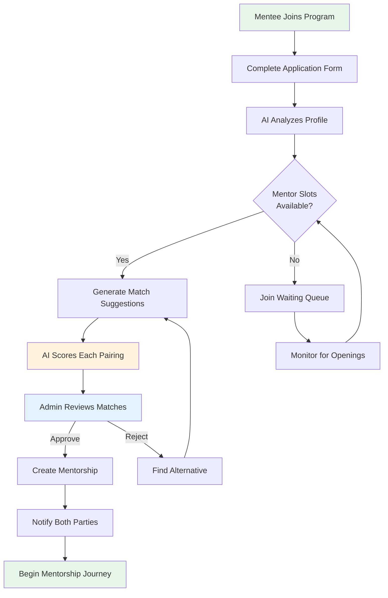
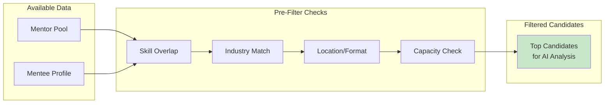
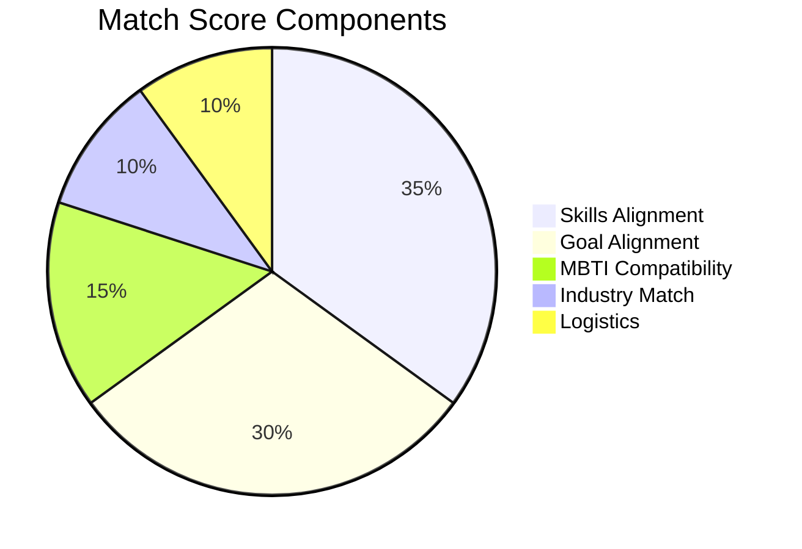
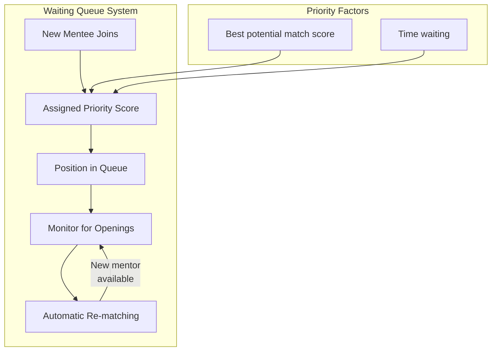
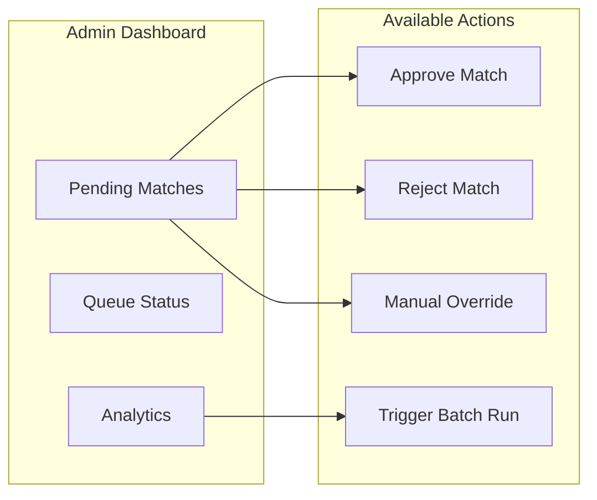
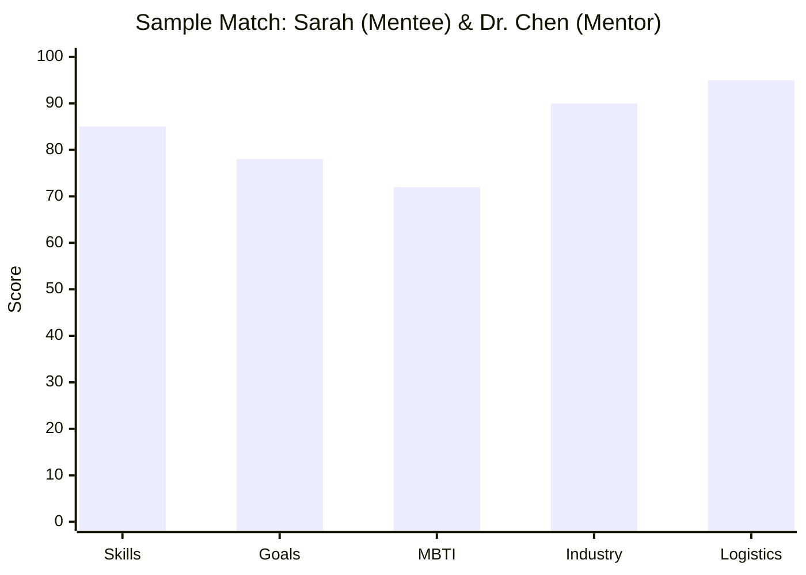
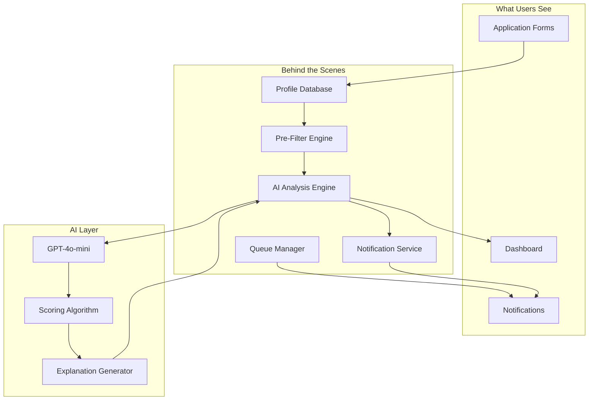

# AI-Powered Mentor-Mentee Matching System

> **The Smart Heart of She Sharp's Mentorship Program**

## Overview

She Sharp's AI Matching System is an intelligent solution that pairs mentees with the most compatible mentors based on multiple factors. By leveraging advanced artificial intelligence, we ensure that each mentorship relationship has the best possible foundation for success.

Think of it as a sophisticated matchmaking service, but instead of romantic compatibility, we optimize for **professional growth** and **career development** potential.

---

## How It Works: The Big Picture

---

## The Matching Process: Step by Step

### Step 1: Profile Collection

When a mentee applies to the program, they provide detailed information about:

| Category | Information Collected |
|----------|----------------------|
| **Personal** | Name, location, career stage |
| **Professional** | Current role, industry, experience |
| **Skills** | Areas of expertise and areas seeking to develop |
| **Personality** | MBTI type (optional but helpful) |
| **Goals** | Short-term objectives, long-term aspirations |
| **Preferences** | Meeting format (online/in-person), industry interests |

Mentors provide similar information, plus their availability and capacity for mentees.

### Step 2: Intelligent Pre-Filtering

Before the AI performs deep analysis, the system quickly identifies promising pairs:

This smart pre-filtering:
- **Saves resources** by only analyzing pairs with real potential
- **Speeds up matching** by focusing on the most promising combinations
- **Ensures quality** by setting a minimum compatibility threshold

### Step 3: AI-Powered Compatibility Analysis

For each promising mentor-mentee pair, our AI examines five key dimensions:

#### The Five Dimensions Explained

| Dimension | Weight | What It Measures |
|-----------|--------|-----------------|
| **Skills Alignment** | 35% | How well the mentor's expertise matches what the mentee wants to learn |
| **Goal Alignment** | 30% | Whether the mentor can help achieve the mentee's career objectives |
| **MBTI Compatibility** | 15% | Personality compatibility for effective communication |
| **Industry Match** | 10% | Overlap in industry experience and interests |
| **Logistics** | 10% | Practical factors like location, time zones, meeting preferences |

### Step 4: AI Analysis Output

For each pair, the AI provides:

1. **Overall Match Score** (0-100)
   - 80+ = Excellent match
   - 65-79 = Good match
   - 50-64 = Moderate match
   - Below 50 = Not recommended

2. **Confidence Level**
   - **High**: Strong data, clear compatibility patterns
   - **Medium**: Good indicators, some uncertainty
   - **Low**: Limited data, manual review recommended

3. **Detailed Insights**
   - Strengths of the pairing
   - Potential challenges to address
   - Suggested focus areas for the relationship

---

## The Waiting Queue: Fair and Transparent

When mentor capacity is limited, mentees join a smart waiting queue:

### How Priority Works

| Factor | Impact |
|--------|--------|
| **Higher match potential** | Moves up in queue (ensures good matches happen) |
| **Longer wait time** | Gradually increases priority (fairness) |
| **Queue expiry** | After 90 days, entry expires (can re-join) |

---

## Admin Review Dashboard

Administrators have full visibility and control:

### What Admins See

For each suggested match:
- Both profiles side by side
- AI explanation of why they're compatible
- Strengths and potential challenges
- Confidence level
- One-click approve/reject

---

## Match Score Breakdown: A Real Example

Here's how a match might be scored:

| Factor | Score | AI Explanation |
|--------|-------|----------------|
| Skills | 85/100 | "Dr. Chen's data science expertise directly addresses Sarah's goal to transition into analytics" |
| Goals | 78/100 | "Strong alignment on career advancement objectives; mentor experienced similar transition" |
| MBTI | 72/100 | "INTJ (mentor) and ENFP (mentee) - complementary styles, good growth potential" |
| Industry | 90/100 | "Both in tech sector; mentor's healthcare tech background relevant to mentee's interests" |
| Logistics | 95/100 | "Both in Auckland; both prefer hybrid meetings" |

**Overall Score: 84/100 (Excellent Match)**

**AI Recommendation**: "Highly recommended pairing. Sarah's enthusiasm for learning complements Dr. Chen's teaching style. Suggest focusing initial sessions on data visualization fundamentals."

---

## The Technology Behind the Scenes

### Key Features

| Feature | Benefit |
|---------|---------|
| **GPT-4o-mini Integration** | State-of-the-art AI for nuanced compatibility analysis |
| **Caching System** | Fast responses, reduced costs |
| **Fallback Algorithm** | System continues working even if AI unavailable |
| **Batch Processing** | Efficient handling of multiple matches |
| **Real-time Updates** | Instant notifications when matched |

---

## Success Metrics

The system tracks and optimizes for:

| Metric | Target | Why It Matters |
|--------|--------|----------------|
| **Match Acceptance Rate** | >85% | Measures AI accuracy |
| **Relationship Completion** | >70% | Validates pairing quality |
| **User Satisfaction** | >4.5/5 | Overall experience |
| **Average Queue Wait** | <14 days | Service efficiency |

---

## Privacy and Fairness

### Data Protection
- All personal data encrypted
- Profile information only shared with potential matches
- Users can update preferences anytime

### Fairness Measures
- No discrimination based on protected characteristics
- Priority based only on match potential and wait time
- Regular audits of matching patterns

---

## Frequently Asked Questions

### For Mentees

**Q: How long until I get matched?**
> It depends on mentor availability. If slots are open, matching happens within days. If not, you'll join our priority queue and be notified as soon as a compatible mentor becomes available.

**Q: Can I reject a match?**
> Matches are reviewed by admins before finalization. If you have concerns about a suggested mentor, you can discuss with the admin team.

**Q: What if the AI match doesn't work out?**
> That's okay! Relationships can be paused or ended, and you can be re-entered into the matching system.

### For Mentors

**Q: How many mentees can I have?**
> You set your own limit (typically 1-5). The system respects your capacity settings.

**Q: Can I see why a mentee was matched with me?**
> Yes! You'll receive an explanation of the compatibility factors and suggested focus areas.

### For Administrators

**Q: Can I override AI decisions?**
> Absolutely. The AI provides recommendations, but humans make final decisions.

**Q: How do I run batch matching?**
> The admin dashboard has a "Run Matching" button that processes all waiting mentees.

---

## Conclusion

She Sharp's AI Matching System combines:
- **Advanced AI** for intelligent analysis
- **Human oversight** for quality assurance
- **Fair queuing** for transparent waiting
- **Clear communication** throughout the process

The result? Mentorship relationships built on a foundation of genuine compatibility, setting both mentors and mentees up for success.

---

*Last updated: December 2024*
